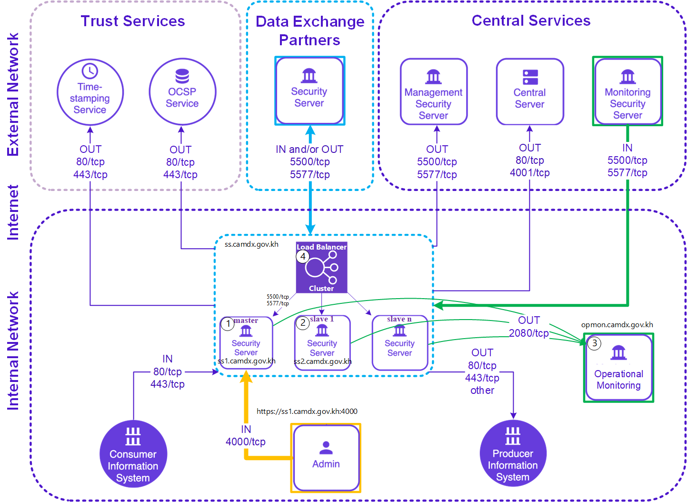

# Security Server HA Cluster with External Loadbalancer

This ansible playbook installs and configures a master-replica security server cluster, Nginx and External Operational Monitoring.

The playbook has been tested with Ubuntu 18.04 LTS and ansible 2.9.27


## Sample Scenario: 5 instances of Ubuntu 18.04 LTS

1. ss1.camdx.gov.kh 10.0.10.71 (master)
2. ss2.camdx.gov.kh 10.0.10.72 (slave1)
3. ss3.camdx.gov.kh 10.0.10.73 (slave2)
4. opmon.camdx.gov.kh 10.0.10.63 (operational monitor)
5. ss.camdx.gov.kh 10.0.10.100 \<public_ip\> (nginx)

Note: ss.camdx.gov.kh is resolved locally to the private IP of 10.0.10.100 and publicly to \<public_ip\> for NATed security server communication on TCP/5500 and TCP/5577 in CamDX ecosystem.

## Overview


## Prerequisites

* The control host executing this playbook has ssh access with sudo privileges on all the hosts.
    * Ansible version >2.1 required
    * The playbook will be executed with a "-K" asking for privilege escalation password and Note that this password will be used for all hosts
    * If the privilege escalation password is different for each host, please specify in the "hosts/camdx_hosts.txt" the "ansible_sudo_pass"
    * Though this sample "hosts/camdx_hosts.txt" stores passwords in plaintext, It is recommended to protect your passwords with ansible-vault
* Please change all the \<value\> in hosts/camdx_hosts.txt
* Change the serverconf_password in group_vars/all and preferably encrypt the file using ansible vault. 
    * The serverconf_password is used to authenticate the local connections to the serverconf database. The default is 'serverconf'.
* Please make sure to hash the password for the "xroad_ui_user_password" variable.
    * In this sample scenario, we hash the xroad_ui_user_password value with "python3-bcrypt"
```bash
python3 -c 'import crypt,getpass;pw=getpass.getpass();print(crypt.crypt(pw) if (pw==getpass.getpass("Confirm: ")) else exit())'
```
   
The setup assumes that the security servers are in the same subnet. If that is not the case, one needs to modify primary's pg_hba.conf so that it accepts replication configurations from the correct network(s).

## Running the playbook

Remember to back up the servers before proceeding.
```
ansible-playbook -i hosts/camdx_hosts.txt camdx_ss_prod.yml -K
```


The playbook does the following operations
* generate certificates for master-slave PostgreSQL replication connections
* install and configure nginx for master and slave load-balance
* install security sever package for master, slave1, slave2 and external operational monitor
* configure high availability security server with support for external operational monitor
   - Master
      - Stop the CamDX Security Server services
      - Data Replication Setup - Create a separate PostgreSQL instance for the serverconf database
      - Change /etc/xroad/db.properties to point to the separate database instance
      - Data Replication Setup - Configuration file replication
      - Configure the node type as master in /etc/xroad/conf.d/node.ini
         -	[node]
         -	type=master
      - Change the owner and group of the file to xroad:xroad if it is not already
      - Start the CamDX Security Server services
   - Slaves
      - Stop the CamDX Security Server services.
      - Data Replication Setup - Create a separate PostgreSQL instance for the serverconf database
      - Change /etc/xroad/db.properties to point to the separate database instance
      - Data Replication Setup - Configuration file replication
      - Configure the node type as master in /etc/xroad/conf.d/node.ini
         - [node]
         - type=slave
      - Change the owner and group of the file to xroad:xroad if it is not already
      - Start the CamDX Security Server services
* configure external operational monitor

## Check if everything is working
1. locally access web-admin and login with the camdx-systemadmin user for both Security Server Master and Slave
   - https://ss1.camdx.gov.kh:4000
   - https://ss2.camdx.gov.kh:4000
   - https://ss3.camdx.gov.kh:4000
   
2. replication status on Security Server Master Node (ss1.camdx.gov.kh)
```bash
sudo -u postgres psql -p 5433 -c "select * from pg_stat_replication;"
```


3. check local connection on port 2080 from Security Server Master & Slave to Operational Monitor
```bash
nc -vz opmon.camdx.gov.kh 2080
```

4. invoke several requests to nginx and check access log shall the traffic is correctly distributed
```bash
curl -v http://ss.camdx.gov.kh:5577
curl -v http://ss.camdx.gov.kh:5500

tail /var/log/nginx/ss.camdx.gov.kh_access.log
```

## Configure Security Server
Configure Security Server **Master Node** by follow the configuration section in [standalone_security_server_installation_and_configuration.md]([https://github.com/Techo-Startup-Center/CamDX-Documentation/blob/main/standalone_security_server_installation_and_configuration.md](https://github.com/Techo-Startup-Center/CamDX-Documents/blob/main/standalone_security_server_installation_and_configuration.md#4-configuration)
