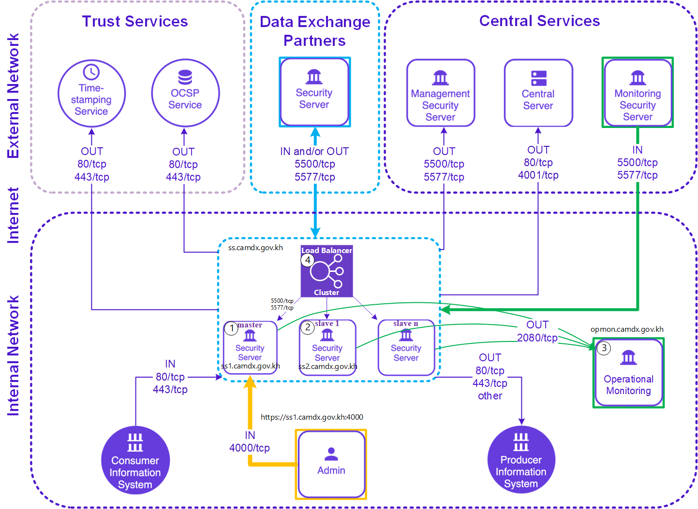
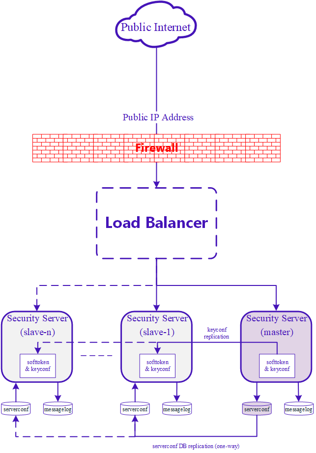

# High Availability Security Server with External Load Balancer and Opmonitor

X-Road 7.2.2

High Availability Setup

## Document version history <!-- omit in toc -->


|Release no|Author|Date|Brief summary of changes|
| :- | :- | :- | :- |
|v1.0.0|CamDX Operator|July 2022||
|v2.0.0|CamDX Operator|May 2023|Update support for Ubuntu 22.04 LTS|

## Table of Contents <!-- omit in toc -->

<!-- toc -->
<!-- vim-markdown-toc GFM -->
- [1. SECURITY SERVER REQUIREMENT](#1-security-server-requirement)

- [2.	State Replication from Master Security Server to Slaves](#2-state-replication-from-master-security-server-to-slaves)

- [3.	INSTALLATION](#3-installation)

  - [3.1	Prerequisites](#31-prerequisites)

  - [3.2	Database Replication Setup](#32-database-replication-setup)
  
  - [3.3	Data Replication Setup](#33-data-replication-setup)

  - [3.4	Verification](#34-verification)

- [4.	EXTERNAL LOAD BALANCER](#4-external-load-balancer)

  - [4.1	Installation and Configuration](#41-installation-and-configuration)

- [5.	INSTALLING AND CONFIGURING EXTERNAL OPERATIONAL MONITORING](#5-installing-and-configuring-external-operational-monitoring)

  - [5.1	Hardware Requirement](#51-hardware-requirement)

  - [5.2	Configure External Operational Monitoring](#52-configure-external-operational-monitoring)

  - [5.3	Configure Master node for External Operational Monitoring](#53-configure-master-node-for-external-operational-monitoring)

- [6.	CONFIGURATION](#6-configuration)

- [7.	REFERENCES](#7-references)

## 1 Network Diagram
The network diagram below provides an example of a basic Security Server setup. Allowing incoming connections from the Monitoring Security Server on ports 5500/tcp and 5577/tcp is necessary for the CamDX Operator to be able to monitor the ecosystem and provide statistics and support for Members.


<p align="center"> FIGURE 1 – NETWORK DIAGRAM </p>

## 2 State Replication from Master Security Server to Slaves

- State Replication from the master to the slaves
- Replicated State: 
  - severconf DB: PostgreSQL streaming replication (Hot standby), 
  - keyconf replication(softtoken & keyconf): rsync+ssh (scheduled),
  - Other server configuration parameters from /etc/xroad/\: rsync+ssh (schedule)
    - db.properties
    - postgresql/\*
    - globalconf/
    - conf.d/node.ini
- Non-replicated State: 
  - messagelog DB
  - OCSP responses from /var/cache/xroad




<p align="center"> FIGURE 2 – MASTER SLAVES STATE REPLICATION </p>

## 3 INSTALLATION
### 3.1 Prerequisites
In order to properly setup data replication, the slave nodes must be able to connect to:

- The master server using SSH (tcp port 22), and
- The master serverconf database (e.g tcp port 5433)

### 3.2 Database Replication Setup
**3.2.1 Create a Separate PostgreSQL Instance for serverconf Database on Master Node**

*Setting up TLS Certificate for Database Authentication:*
- Generate the Certificate Authority Key and a self-signed Certificate for the root-of-trust
```bash
root@master# openssl req -new -x509 -days 7300 -nodes -sha256 -out ca.crt -keyout ca.key -subj '/O=CamDX/CN=CA'
```
- Generate Keys and Certificates signed by the CA for each PostgreSQL Instance, including the master. Do not use
the CA certificate and key as the database certificate and key
```bash
root@master# openssl req -new -nodes -days 7300 -keyout server.key -out server.csr -subj "/O=CamDX/CN=ss1"

root@master# openssl x509 -req -in server.csr -CAcreateserial -CA ca.crt -CAkey ca.key -days 7300 -out server.crt
```
- Copy the Certificates and Keys
```bash
root@master# mkdir -p -m 0755 /etc/xroad/postgresql
root@master# chmod o+x /etc/xroad
root@master# cp ca.crt server.crt server.key /etc/xroad/postgresql
root@master# chown postgres /etc/xroad/postgresql/*
root@master# chmod 400 /etc/xroad/postgresql/*
```
*Create a serverconf database by using the following command:*
```bash
root@master# sudo -u postgres pg_createcluster -p 5433 14 serverconf
```
*Configuring the master instance for replication:*
```bash
root@master# vim /etc/postgresql/14/serverconf/postgresql.conf
```
```bash
ssl = on
ssl_ca_file = '/etc/xroad/postgresql/ca.crt'
ssl_cert_file = '/etc/xroad/postgresql/server.crt'
ssl_key_file = '/etc/xroad/postgresql/server.key'

listen_addresses = '*'
wal_level = hot_standby
max_wal_senders = 3 
wal_keep_segments = 8 
```
```bash
root@master# vim /etc/postgresql/10/serverconf/pg_hba.conf
```
```bash
hostssl replication +slavenode 10.0.10.20/32 cert

#10.0.10.20/32 is the slave node IP
```
```bash
root@master# systemctl start postgresql@14-serverconf
root@master# sudo -u postgres psql -p 5433 -c "CREATE ROLE slavenode NOLOGIN";
root@master# sudo -u postgres psql -p 5433 -c "CREATE USER "ss2" REPLICATION PASSWORD NULL IN ROLE slavenode";
root@master# sudo -u postgres psql -p 5433 -c "CREATE USER serverconf PASSWORD '<Passw0rd>'";
root@master# sudo -u postgres pg_dump -C serverconf | sudo -u postgres psql -p 5433 -f -
root@master# sudo -u postgres psql -p 5432 -c "ALTER DATABASE serverconf RENAME TO serverconf_old";
```
```bash
root@master# vim /etc/xroad/db.properties
```
```bash
serverconf.hibernate.connection.url = jdbc:postgresql://127.0.0.1:5433/serverconf
serverconf.hibernate.connection.password = <Passw0rd>       #created earlier
```
*TLS Certificate for Database Authentication for Slave*

- Generate the Certificate Authority Key and Certificate Signing Request
```bash
root@master# openssl req -new -nodes -days 7300 -keyout server_ss2.key -out server_ss2.csr -subj "/O=CamDX/CN=ss2"

root@master# openssl x509 -req -in server_ss2.csr -CAcreateserial -CA ca.crt -CAkey ca.key -days 7300 -out server_ss2.crt
```

**3.2.2 Create a Separate PostgreSQL Instance for serverconf Database on Slave Node**

*Setting up TLS Certificate for Database Authentication:*
- Generate Keys and Certificates signed by the CA for each PostgreSQL Instance, including the master. Do not use
the CA certificate and key as the database certificate and key
```bash
root@slave# mkdir -p -m 0755 /etc/xroad/postgresql
root@slave# chmod o+x /etc/xroad
```
- Copy certificates and key from Master to Slave
```bash
root@master# scp ca.crt server_ss2.crt server_ss2.key slave@10.0.10.20/home/slave #10.0.10.20 is slave node's IP
root@slave# mv ca.crt server_ss2.crt server_ss2.key /etc/xroad/postgresql
root@slave# chown postgres /etc/xroad/postgresql/*
root@slave# chmod 400 /etc/xroad/postgresql/*
```
*Create a serverconf database by using the following command:*
```bash
root@slave# sudo -u postgres pg_createcluster -p 5433 14 serverconf
```
*Configuring the slave instance for replication:*
```bash
root@slave# rm -rf /var/lib/postgresql/14/serverconf/*
```
```bash
root@slave# sudo -u postgres PGSSLMODE=verify-ca PGSSLROOTCERT=/etc/xroad/postgresql/ca.crt PGSSLCERT=/etc/xroad/postgresql/server_ss2.crt PGSSLKEY=/etc/xroad/postgresql/server_ss2.key pg_basebackup -h 10.0.10.10 -p 5433 -U ss2 -D /var/lib/postgresql/14/serverconf/

#10.0.10.10 is master node's IP
```
```bash
root@slave# touch /var/lib/postgresql/14/serverconf/standby.signal
root@slave# chown postgres:postgres /var/lib/postgresql/14/serverconf/standby.signal
root@slave# chmod 0600 /var/lib/postgresql/14/serverconf/standby.signal
```
```bash
root@slave# vim /etc/postgresql/14/serverconf/postgresql.conf
```
```bash
ssl = on
ssl_ca_file = '/etc/xroad/postgresql/ca.crt'
ssl_cert_file = '/etc/xroad/postgresql/server_ss2.crt'
ssl_key_file = '/etc/xroad/postgresql/server_ss2.key'
listen_addresses = '*'

# no need to send WAL logs
# wal_level = minimal
# max_wal_senders = 0
# wal_keep_segments = 0

hot_standby = on
hot_standby_feedback = on

primary_conninfo = 'host=10.0.10.10 port=5433 user=ss2 sslmode=verify-ca sslcert=/etc/xroad/postgresql/server_ss2.crt sslkey=/etc/xroad/postgresql/server_ss2.key sslrootcert=/etc/xroad/postgresql/ca.crt'
```
```bash
root@slave# systemctl start postgresql@14-serverconf
root@slave# vim /etc/xroad/db.properties
```
```bash
serverconf.hibernate.connection.url = jdbc:postgresql://127.0.0.1:5433/serverconf
serverconf.hibernate.connection.password = <Passw0rd>        #this was created on Master node
```

### 3.3 Data Replication Setup
**3.3.1 Setup SSH between slaves and master**

***On slave**, generate the ssh key for the xroad user by using the following command: (**without a passphrase**)*
```bash
root@slave# sudo -i -u xroad
xroad@slave# ssh-keygen -t rsa
```
*Copy ssh xroad public key to the Master Node for later adding to **/home/xroad-slave/.ssh/authorized_keys***
```bash
xroad@slave# cat /var/lib/xroad/.ssh/id_rsa.pub
```
***On Master**, setup a system user that can read **/etc/xroad** a system user has their password disabled and cannot log in normally*
```bash
root@master# adduser --system --shell /bin/bash --ingroup xroad xroad-slave

root@master# mkdir -m 755 -p /home/xroad-slave/.ssh && sudo touch /home/xroad-slave/.ssh/authorized_keys
```
*paste the copied **id_rsa.pub** from slave*
```bash
root@master# vim /home/xroad-slave/.ssh/authorized_keys
```
***On slave**, test ssh to master without password with user **xroad-slave**, and accept key*
```bash
xroad@slave# ssh xroad-slave@10.0.10.10              #this must work without password
xroad-slave@master# exit
xroad@slave# exit
```
*Setup periodic configuration synchronization on the slave node*
```bash
root@slave# vim /etc/systemd/system/xroad-sync.service
```
```bash
[Unit]
Description=X-Road Sync Task
After=network.target
Before=xroad-proxy.service
Before=xroad-signer.service
Before=xroad-confclient.service
Before=xroad-proxy-ui-api.service

[Service]
User=xroad
Group=xroad
Type=oneshot
Environment=XROAD_USER=xroad-slave
Environment=MASTER=10.0.10.10                 #Master node's IP
ExecStartPre=/usr/bin/test ! -f /var/tmp/xroad/sync-disabled

ExecStart=/usr/bin/rsync -e "ssh -o ConnectTimeout=5 " -aqz --timeout=10 --delete-delay --exclude db.properties --exclude "/conf.d/node.ini" --exclude "*.tmp" --exclude "/postgresql" --exclude "/nginx" --exclude "/globalconf" --exclude "/jetty" --exclude "/gpghome" --delay-updates --log-file=/var/log/xroad/slave-sync.log ${XROAD_USER}@${MASTER}:/etc/xroad/ /etc/xroad/

[Install]
WantedBy=multi-user.target
WantedBy=xroad-proxy.service
```
```bash
root@slave# vim /etc/systemd/system/xroad-sync.timer
```
```bash
[Unit]
Description=Sync X-Road configuration

[Timer]
OnBootSec=60
OnUnitActiveSec=60

[Install]
WantedBy=timers.target
```
```bash
root@slave# systemctl enable xroad-sync.timer xroad-sync.service
root@slave# systemctl start xroad-sync.timer
```
```bash
root@slave# vim /etc/logrotate.d/xroad-slave-sync
```
```bash
/var/log/xroad/slave-sync.log {
  daily
  rotate 7
  missingok
  compress
  su xroad xroad
  nocreate
}
```
**3.3.2 Configure Node Type: (Both Master and Slave)**

*Configure node type **on Master***
```bash
root@master# vim /etc/xroad/conf.d/node.ini
```
```bash
[node]
type=master
```
```bash
root@master# chown xroad:xroad /etc/xroad/conf.d/node.ini
root@master# systemctl start "xroad-*"
```
*Configure node type **on Slave***
```bash
root@slave# vim /etc/xroad/conf.d/node.ini
```
```bash
[node]
type=slave
```
```bash
root@slave# chown xroad:xroad /etc/xroad/conf.d/node.ini
root@slave# systemctl start "xroad-*"
```
### 3.4 Verification
**3.4.1 Verifying rsync+ssh replication:**

To test the configuration file replication, a new file can be added to **/etc/xroad** or **/etc/xroad/signer** on the **master node** and verify it has been replicated to the **slave nodes** in a few minutes. Make sure the file is owned by the group xroad.
```bash
root@master# touch /etc/xroad/test.txt
root@master# chown xroad:xroad /etc/xroad/test.txt
```
Alternatively, check the sync log **/var/log/xroad/slave-sync.log** on the **slave nodes** and verifying its lists successful transfers.
```bash
root@slave# tail /var/log/xroad/slave-sync.log
```
```
2023/05/10 09:05:57 [429649] >f..t...... signer/keyconf.xml
2023/05/10 09:05:57 [429647] sent 253 bytes  received 1602 bytes  total size 62932
2023/05/10 09:07:24 [429685] receiving file list
2023/05/10 09:07:24 [429688] .d..t...... signer/
2023/05/10 09:07:24 [429688] >f..t...... signer/keyconf.xml
2023/05/10 09:07:24 [429685] sent 253 bytes  received 1602 bytes  total size 62932
2023/05/10 09:08:26 [429710] receiving file list
2023/05/10 09:08:26 [429712] .d..t...... signer/
2023/05/10 09:08:26 [429712] >f..t...... signer/keyconf.xml
2023/05/10 09:08:26 [429710] sent 253 bytes  received 1602 bytes  total size 62932
```

**3.4.2 Verifying database replication: on Master**

```bash
root@master# sudo -u postgres psql -p 5433 -c "select * from pg_stat_replication;"
```
A successful replication with two secondary nodes could look like this:

| pid  | usesysid | usename  | application_name |  client_addr   | client_hostname | client_port |         backend_start         | backend_xmin |   state   | sent_location | write_location | flush_location | replay_location | sync_priority | sync_state |
|------|----------|----------|------------------|----------------|-----------------|-------------|-------------------------------|-----------|-----------|---------------|----------------|----------------|-----------------|---------------|------------|
| 115280 |    16385 | ss2 | 14/serverconf      | 10.0.10.20 |                 |       49624 | 2023-05-10 10:30:50.470084+07 | 904 | streaming | 0/3019860     | 0/3019860      | 0/3019860      | 0/3019860       |             0 | async      |


## 4 EXTERNAL LOAD BALANCER
### 4.1 Installation and Configuration
**4.1.1 Installation**

*On another instance for external loadbalancer*
```bash
root@loadbalancer# apt update && apt upgrade -y
root@loadbalancer# timedatectl set-timezone Asia/Phnom_Penh
root@loadbalancer# apt install nginx -y
```
**4.1.2 Configuring Passthrough on port 5500, 5577, 80, and 443**

In this High Availability Security Server setup with External Load Balancer, please note that the dns record for security server should be resolved to the load balancer for traffic distribution to each servers (It is possible to seperate External and Local Reverse Proxy stationing in different security zone)

DNS: 	ss-dev.company1.com.kh => <ip_of_load_balancer>

*Add to the bottom of **/etc/nginx/nginx.conf**  to include the passthrough configuration file*
```bash
root@loadbalancer# vim /etc/nginx/nginx.conf
```
```bash
include /etc/nginx/passthrough.conf;
```
*Remove the default configuration file*
```bash
root@loadbalancer# rm -rf /etc/nginx/sites-enabled/default
```
*Create the passthrough configuration file*
```bash
root@loadbalancer# vim /etc/nginx/passthrough.conf
```
```bash
stream {
  # Log Format Configuration
  log_format basic '$remote_addr [$time_local] '
        '$protocol $status $bytes_sent $bytes_received '
        '$session_time "$upstream_addr" '
        '"$upstream_bytes_sent" "$upstream_bytes_received" "$upstream_connect_time"';
  # Log File Configuration
  access_log /var/log/nginx/ss-dev.company1.com.kh_access.log basic;
  error_log /var/log/nginx/ss-dev.company1.com.kh_error.log;
  
  # Upstream Configuration for port 5500, 5577, 80, and 443
  upstream camdx_5500 {
    server fqdn_of_ss_master:5500 max_fails=1 fail_timeout=10s;
    server fqdn_of_ss_slave:5500 max_fails=1 fail_timeout=10s;
  }
  
  upstream camdx_5577 {
    server fqdn_of_ss_master:5577 max_fails=1 fail_timeout=10s;
    server fqdn_of_ss_slave:5577 max_fails=1 fail_timeout=10s;
  }

  upstream camdx_80 {
    server fqdn_of_ss_master:80 max_fails=1 fail_timeout=1s;
    server fqdn_of_ss_slave:80 max_fails=1 fail_timeout=1s;
  }

  upstream camdx_443 {
    server fqdn_of_ss_master:443 max_fails=1 fail_timeout=1s;
    server fqdn_of_ss_slave:443 max_fails=1 fail_timeout=1s;
  }

  # Server Listener
  server {
    listen 5500;
    proxy_pass camdx_5500;
    proxy_next_upstream on;
  }
  server {
    listen 5577;
    proxy_pass camdx_5577;
    proxy_next_upstream on;
  }
  server {
    listen 80;
    proxy_pass camdx_80;
    proxy_next_upstream on;
  }
  server {
    listen 443;
    proxy_pass camdx_443;
    proxy_next_upstream on;
  }
}
```
Test and Restart nginx 
```bash
root@loadbalancer# nginx -t
root@loadbalancer# systemctl restart nginx
```

## 5. INSTALLING AND CONFIGURING EXTERNAL OPERATIONAL MONITORING
### 5.1 Hardware Requirement
- The server’s hardware (motherboard, CPU, network interface cards, storage system) must be supported by Ubuntu in general
- CPU: 2
- RAM: 4GB
- DISK: 100GB
- Network Card: 100 Mbps
- Running Port 2080/tcp (Allow access from Security Servers only)

**Install Security Server Package**
```bash
root@opmonitor# apt update && apt upgrade -y
root@opmonitor# timedatectl set-timezone Asia/Phnom_Penh
root@opmonitor# adduser camdx-systemadmin
root@opmonitor# echo LC_ALL=en_US.UTF-8 | sudo tee -a /etc/environment
root@opmonitor# locale-gen en_US.UTF-8
root@opmonitor# apt install locales software-properties-common

root@opmonitor# curl https://repository.camdx.gov.kh/repository/camdx-anchors/api/gpg/key/0x04194DBF-pub.asc | apt-key add -

root@opmonitor# echo deb [arch=all,amd64] https://repository.camdx.gov.kh/repository/camdx-release jammy main | tee -a /etc/apt/sources.list

root@opmonitor# apt update
root@opmonitor# apt install xroad-securityserver
root@opmonitor# apt install xroad-opmonitor

#Stop and disable Services
root@opmonitor# systemctl stop xroad-proxy
root@opmonitor# systemctl stop xroad-proxy-ui-api
root@opmonitor# systemctl stop xroad-monitor
root@opmonitor# systemctl disable xroad-proxy xroad-proxy-ui-api xroad-monitor
```

### 5.2 Configure External Operational Monitoring
```bash
root@opmonitor# vim /etc/xroad/conf.d/local.ini
```
```bash
[op-monitor]
keep-records-for-days = 30
host = 0.0.0.0
```
```bash
root@opmonitor# curl -o /etc/xroad/configuration-anchor.xml https://repository.camdx.gov.kh/repository/camdx-anchors/anchors/CAMBODIA_configuration_anchor.xml
```
- This configuration anchor specifies the URL for opmonitor to download its global configuration information
- For HTTPs preference, Modify the URL to https as below: (otherwise, keep it as it is)
```bash
<downloadURL>https://cs1-prod.camdx.gov.kh/internalconf</downloadURL>....
<downloadURL>https://cs2-prod.camdx.gov.kh/internalconf</downloadURL>....
<downloadURL>https://cs3-prod.camdx.gov.kh/internalconf</downloadURL>....
```
```bash
root@opmonitor# chown xroad:xroad /etc/xroad/configuration-anchor.xml
root@opmonitor# systemctl restart xroad-opmonitor
```
### 5.3 Configure Master node for External Operational Monitoring
*On Security Server **Master Node**, we also need to edit a configuration file at **/etc/xroad/conf.d/local.ini***
```bash
root@master# vim /etc/xroad/conf.d/local.ini
```
```bash
[op-monitor]
host = 10.0.10.30              #omonitor_ip_or_domain_name
```
*Install xroad-addon-proxymonitor & xroad-addon-opmonitoring - on Master*
```bash
root@master# apt install xroad-addon-proxymonitor
root@master# apt install xroad-addon-opmonitoring
root@master# systemctl restart xroad-opmonitor

#Stop and Disable the Local Operation Monitoring Service on Master Node
root@master# systemctl stop xroad-opmonitor
root@master# systemctl disable xroad-opmonitor
```

*Install xroad-addon-proxymonitor & xroad-addon-opmonitoring - on Slave*
```bash
root@slave# apt install xroad-addon-proxymonitor
root@slave# apt install xroad-addon-opmonitoring
root@slave# systemctl restart xroad-opmonitor

#Check if /etc/xroad/conf.d/local.ini is replicated, then
#Stop and Disable the Local Operation Monitoring Service on Slave Node
root@slave# systemctl stop xroad-opmonitor
root@slave# systemctl disable xroad-opmonitor
```

## 6. CONFIGURATION

Configure Security Server **Master Node** by following the configuration section in [standalone_security_server_installation_and_configuration.md](https://github.com/Techo-Startup-Center/CamDX-Documents/blob/main/standalone_security_server_installation_and_configuration.md#4-configuration)

## 7. REFERENCES

X-Road/ig-xlb_x-road_external_load_balancer_installation_guide.md at camdx-6.23.0 · CamDX/X-Road. (2022). Retrieved 30 May 2022, from <https://github.com/Techo-Startup-Center/CamDX/blob/camdx-6.23.0/doc/Manuals/LoadBalancing/ig-xlb_x-road_external_load_balancer_installation_guide.md>
