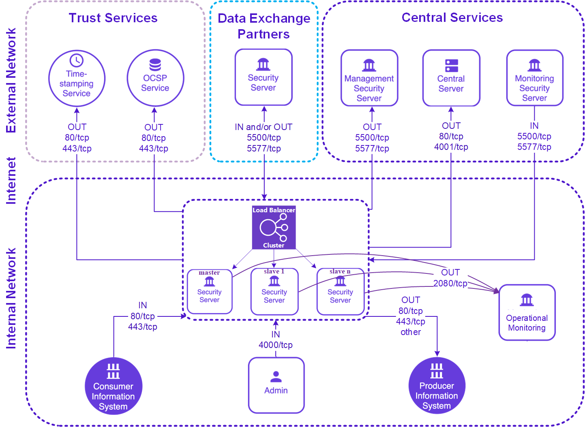
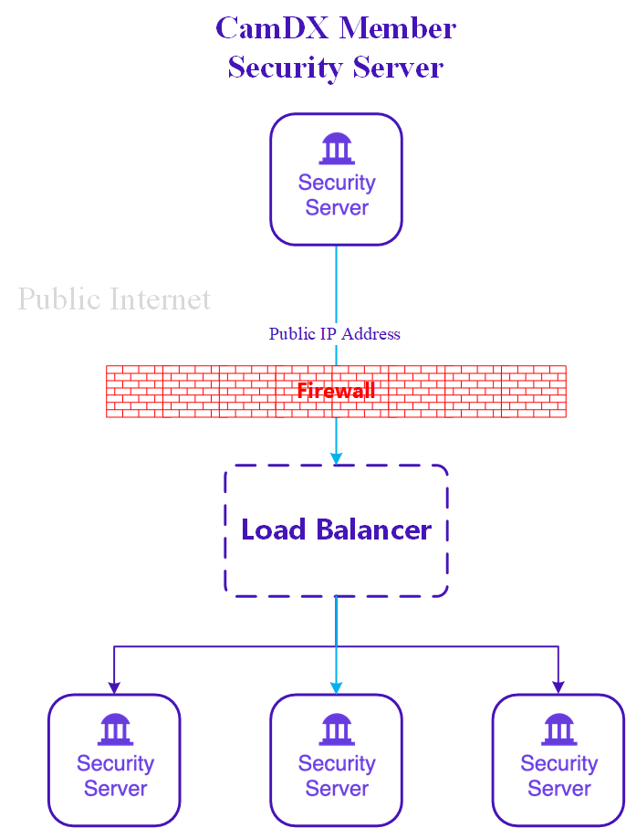
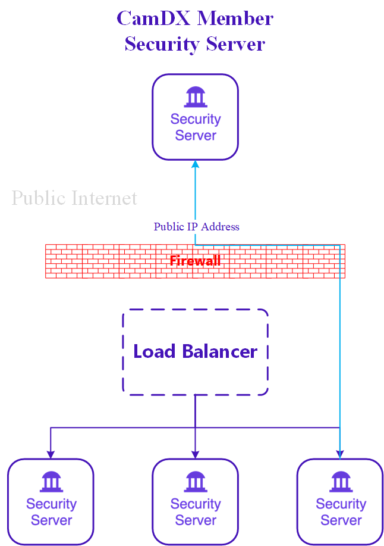
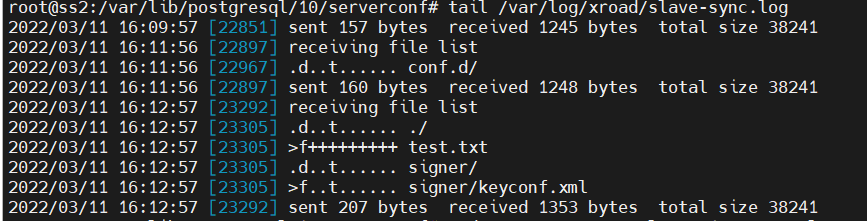
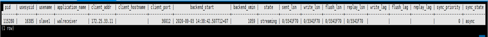

# HIGH AVAILABILITY SECURITY SERVER INSTALLATION WITH EXTERNAL LOAD BALANCER

July 2022

High Availability Security Server Installation with External Load Balancer

## Document version history <!-- omit in toc -->


|Release no|Author|Date|Brief summary of changes|
| :- | :- | :- | :- |
|v1.0.0|Camdx Operator|July 2022||

## Table of Contents <!-- omit in toc -->

<!-- toc -->
<!-- vim-markdown-toc GFM -->
- [1. SECURITY SERVER REQUIREMENT](#1-security-server-requirement)

  - [1.1	Hardware Requirement](#11-hardware-requirement)

  - [1.2	Software](#12-software)

  - [1.3	Network Ports](#13-network-ports)

  - [1.4	Network Diagram](#14-network-diagram)

- [2.	OVERVIEW](#2-overview)

  - [2.1	Inbound Request from Other Member](#21-inbound-request-from-other-member)

  - [2.2	Outbound Request to Other Member](#22-outbound-request-to-other-member)

  - [2.3	State Replication from Master Security Server to Slaves](#23-state-replication-from-master-security-server-to-slaves)

- [3.	INSTALLATION](#3-installation)

  - [3.1	Prerequisites](#31-prerequisites)

  - [3.2	Master Installation Steps](#32-master-installation-steps)

  - [3.3	Slave Installation Steps](#33-slave-installation-steps)

  - [3.4	Data Replication Setup](#34-data-replication-setup)

  - [3.5	Setup Verification](#35-setup-verification)

- [4.	EXTERNAL LOAD BALANCER](#4-external-load-balancer)

  - [4.1	Installation and Configuration](#41-installation-and-configuration)

- [5.	INSTALLING AND CONFIGURING EXTERNAL OPERATIONAL MONITORING](#5-installing-and-configuring-external-operational-monitoring)

  - [5.1	Minimum Requirement](#51-minimum-requirement)

  - [5.2	Install a Standalone Security Server](#52-install-a-standalone-security-server)

  - [5.3	Configure External Operational Monitoring](#53-configure-external-operational-monitoring)

  - [5.4	Configure Master node for External Operational Monitoring](#54-configure-master-node-for-external-operational-monitoring)

- [6.	CONFIGURATION](#6-configuration)

- [7.	REFERENCES](#7-references)

## 1 SECURITY SERVER REQUIREMENT
### 1.1 Hardware Requirement
- CPU: 64-bit dual-core Intel
- RAM: 4GB
- Network Card: 100 Mbps
### 1.2 Software
- Operating System: Ubuntu 18.04 LTS x86-64
  - Add System User 
```bash
sudo adduser camdx-systemadmin
```
- Set the operating system locale.
  - Add following line to the /etc/environment.
```bash
LC_ALL=en_US.UTF-8
```
- Ensure that the packages locales and software-properties-common are present
```bash
sudo apt-get install locales software-properties-common
```
- Ensure that the timezone is set to Asia/Phnom_Penh – timedatectl
```bash
sudo timedatectl set-timezone Asia/Phnom_Penh
```
### 1.3 Network Ports
It is strongly recommended to protect the security server from unwanted access using a firewall (hardware or software based). The firewall can be applied to both incoming and outgoing connections depending on the security requirements of the environment where the security server is deployed. It is recommended to allow incoming traffic to specific ports only from explicitly defined sources using IP filtering. Special attention should be paid with the firewall configuration since incorrect configuration may leave the security server vulnerable to exploits and attacks.

The table below lists the required connections between different components.

|Connection Type|Source|Target|Target Ports|Protocol|Note|
| :-: | :-: | :-: | :-: | :-: | :-: |
|Out|Security Server|Central Server|80, 4001|tcp||
|Out|Security Server|Management Security Server|5500, 5577|tcp||
|Out|Security Server|OCSP Service|80 / 443|tcp||
|Out|Security Server|Timestamping Service|80 / 443|tcp||
|Out|Security Server|Data Exchange Partner Security Server (Service Producer)|5500, 5577|tcp||
|Out|Security Server|Producer Information System|80, 443, other|tcp|Target in the internal network|
|In|Monitoring Security Server|Security Server|5500, 5577|tcp||
|In|Data Exchange Partner Security Server (Service Consumer)|Security Server|5500, 5577|tcp||
|In|Consumer Information System|Security Server|80, 443|tcp|Source in the internal network|
|In|Admin|Security Server|4000|tcp|Source in the internal network|

<p align="center"> TABLE 1 – NETWORK PORTS </p>

### 1.4 Network Diagram
The network diagram below provides an example of a basic Security Server setup. Allowing incoming connections from the Monitoring Security Server on ports 5500/tcp and 5577/tcp is necessary for the CamDX Operator to be able to monitor the ecosystem and provide statistics and support for Members.


<p align="center"> FIGURE 1 – NETWORK DIAGRAM </p>

## 2 OVERVIEW
### 2.1 Inbound Request from Other Member




<p align="center"> FIGURE 2 – INBOUND REQUEST </p>

### 2.2 Outbound Request to Other Member




<p align="center"> FIGURE 3 – OUTBOUND REQUEST </p>

### 2.3 State Replication from Master Security Server to Slaves

- State Replication from the master to the slaves
- Replicated State: 
  - severconf DB: PostgreSQL streaming replication (Hot standby), 
  - keyconf replication(softtoken & keyconf): rsync+ssh (scheduled)
  - Other server configuration parameters from /etc/xroad/\: rsync+ssh (schedule)
    - db.properties
    - postgresql/\*
    - globalconf/
    - conf.d/node.ini
- Non-replicated State: 
  - messagelog DB
  - OCSP responses from /var/cache/xroad


<p align="center"> FIGURE 4 – MASTER SLAVES STATE REPLICATION </p>

## 3 INSTALLATION
### 3.1 Prerequisites
In order to properly setup data replication, the slave nodes must be able to connect to:

- The master server using SSH (tcp port 22), and
- The master serverconf database (e.g tcp port 5433)

### 3.2 Master Installation Steps

- Install the CamDX Security Server packages using the normal installation guideline or use an existing standalone node.
- Stop the CamDX Security Server services. By using command: sudo systemctl stop "xroad-\"
- Data Replication Setup - Create a separate PostgreSQL instance for the serverconf database
- Change /etc/xroad/db.properties to point to the separate database instance
  - serverconf.hibernate.connection.url: change the url port number from 5432 to 5433 (or the port you specified)
  - serverconf.hibernate.connection.password: Change to match the master db's password (in plaintext)
- Data Replication Setup - Configuration file replication (3.4.1, 3.4.3, 3.4.4)
- Configure the node type as master in /etc/xroad/conf.d/node.ini
  - [node]
  - type=master
- Change the owner and group of the file to xroad:xroad if it is not already
- Start the CamDX Security Server services
### 3.3 Slave Installation Steps
- Install the CamDX Security Server packages using the normal installation guideline or use an existing standalone node.
- Stop the CamDX Security Server services. By using command: sudo systemctl stop "xroad-\*"
- Data Replication Setup - Create a separate PostgreSQL instance for the serverconf database
- Change /etc/xroad/db.properties to point to the separate database instance
  - serverconf.hibernate.connection.url: change the url port number from 5432 to 5433 (or the port you specified)
  - serverconf.hibernate.connection.password: Change to match the master db's password (in plaintext)
- Data Replication Setup - Configuration file replication (3.4.2, 3.4.3, 3.4.4)
- Configure the node type as master in /etc/xroad/conf.d/node.ini
  - [node]
  - type=slave
- Change the owner and group of the file to xroad:xroad if it is not already
- Start the CamDX Security Server services

### 3.4 Data Replication Setup
**3.4.1 Create a Separate PostgreSQL Instance for serverconf Database on Master Node**

*Setting up TLS Certificate for Database Authentication:*
- Generate the Certificate Authority Key and a self-signed Certificate for the root-of-trust
```bash
openssl req -new -x509 -days 7300 -nodes -sha256 -out ca.crt -keyout ca.key -subj '/O=COMPANY1 CO LTD/CN=CA'
```
- Generate Keys and Certificates signed by the CA for each PostgreSQL Instance, including the master. Do not use
the CA certificate and key as the database certificate and key
```bash
openssl req -new -nodes -days 7300 -keyout server.key -out server.csr -subj "/O=COMPANY1 CO
LTD/CN=ss1.company1.com"

openssl x509 -req -in server.csr -CAcreateserial -CA ca.crt -CAkey ca.key -days 7300 -out server.crt
```
- Copy the Certificates and Keys
```bash
sudo mkdir -p -m 0755 /etc/xroad/postgresql
sudo chmod o+x /etc/xroad
sudo cp ca.crt server.crt server.key /etc/xroad/postgresql
sudo chown postgres /etc/xroad/postgresql/*
sudo chmod 400 /etc/xroad/postgresql/*
```
*Create a serverconf database by using the following command:*
```bash
sudo -u postgres pg_createcluster -p 5433 10 serverconf
```
*Configuring the master instance for replication:*
```bash
sudo vim /etc/postgresql/10/serverconf/postgresql.conf
```
```bash
ssl = on
ssl_ca_file = '/etc/xroad/postgresql/ca.crt'
ssl_cert_file = '/etc/xroad/postgresql/server.crt'
ssl_key_file = '/etc/xroad/postgresql/server.key'
listen_addresses = '*' # (default is localhost. Alternatively: localhost, <IP of the interface the slaves connect to>")
wal_level = hot_standby
max_wal_senders = 3 # should be ~ number of slaves plus some small number. Here, we assume there are two slaves.
wal_keep_segments = 8 # keep some wal segments so that slaves that are offline can catch up.
```
```bash
sudo vim /etc/postgresql/10/serverconf/pg_hba.conf
```
```bash
hostssl replication +slavenode samenet cert
```
```bash
systemctl start postgresql@10-serverconf
sudo -u postgres psql -p 5433 -c "CREATE ROLE slavenode NOLOGIN";
sudo -u postgres psql -p 5433 -c "CREATE USER "ss2" REPLICATION PASSWORD NULL IN ROLE slavenode";
sudo -u postgres psql -p 5433 -c "CREATE USER serverconf PASSWORD '<Passw0rd>'";
sudo -u postgres pg_dump -C serverconf | sudo -u postgres psql -p 5433 -f -
sudo -u postgres psql -p 5432 -c "ALTER DATABASE serverconf RENAME TO serverconf_old";
```
```bash
sudo vim /etc/xroad/db.properties
```
```bash
serverconf.hibernate.connection.url = jdbc:postgresql://127.0.0.1:5433/serverconf
serverconf.hibernate.connection.password = <Passw0rd>
```
*TLS Certificate for Database Authentication for Slave*

- Generate the Certificate Authority Key and Certificate Signing Request
```bash
openssl req -new -nodes -days 7300 -keyout server_ss2.key -out server_ss2.csr -subj "/O=COMPANY1 CO LTD/CN=ss2"

openssl x509 -req -in server_ss2.csr -CAcreateserial -CA ca.crt -CAkey ca.key -days 7300 -out server_ss2.crt
```

**3.4.2 Create a Separate PostgreSQL Instance for serverconf Database on Slave Node**

*Setting up TLS Certificate for Database Authentication:*
- Generate Keys and Certificates signed by the CA for each PostgreSQL Instance, including the master. Do not use
the CA certificate and key as the database certificate and key
```bash
sudo mkdir -p -m 0755 /etc/xroad/postgresql
sudo chmod o+x /etc/xroad
```
- Copy certificates and key from Master to Slave
```bash
sudo scp ca.crt server_ss2.crt server_ss2.key ss2@fqdn_of_ss_slave/home/ss2 #on Master Node
sudo mv ca.crt server_ss2.crt server_ss2.key /etc/xroad/postgresql
sudo chown postgres /etc/xroad/postgresql/*
sudo chmod 400 /etc/xroad/postgresql/*
```
*Create a serverconf database by using the following command:*
```bash
sudo -u postgres pg_createcluster -p 5433 10 serverconf
```
*Configuring the slave instance for replication:*
```bash
sudo -i
cd /var/lib/postgresql/10/serverconf
sudo rm -rf *

sudo -u postgres PGSSLMODE=verify-ca PGSSLROOTCERT=/etc/xroad/postgresql/ca.crt PGSSLCERT=/etc/xroad/postgresql/server_ss2.crt PGSSLKEY=/etc/xroad/postgresql/server_ss2.key

pg_basebackup -h fqdn_of_ss_master -p 5433 -U ss2 -D .

sudo vim recovery.conf
```
```bash
standby_mode = 'on'

primary_conninfo = 'host=<fqdn_of_ss_master> port=5433 user=ss2 sslmode=verify-ca sslcert=/etc/xroad/postgresql/server_ss2.crt sslkey=/etc/xroad/postgresql/server_ss2.key sslrootcert=/etc/xroad/postgresql/ca.crt'

trigger_file = '/var/lib/xroad/postgresql.trigger'
```
```bash
sudo chown postgres:postgres recovery.conf
sudo chmod 0600 recovery.conf
sudo vim /etc/postgresql/10/serverconf/postgresql.conf
```
```bash
ssl = on
ssl_ca_file = '/etc/xroad/postgresql/ca.crt'
ssl_cert_file = '/etc/xroad/postgresql/server_ss2.crt'
ssl_key_file = '/etc/xroad/postgresql/server_ss2.key'
listen_addresses = localhost
hot_standby = on
hot_standby_feedback = on
```
```bash
sudo systemctl start postgresql@10-serverconf
sudo vim /etc/xroad/db.properties
```
```bash
serverconf.hibernate.connection.url = jdbc:postgresql://127.0.0.1:5433/serverconf
serverconf.hibernate.connection.password = <Passw0rd>
```

**3.4.3 Setup SSH between slaves and master**

***On slave**, generate the ssh key for the xroad user by using the following command: (**without a passphrase**)*
```bash
sudo -i -u xroad
ssh-keygen -t rsa
```
*Copy ssh xroad public key to the Master Node for later adding to **/home/xroad-slave/.ssh/authorized_keys***
```bash
cat /var/lib/xroad/.ssh/id_rsa.pub
```
***On Master**, setup a system user that can read **/etc/xroad** a system user has their password disabled and cannot log in normally*
```bash
sudo adduser --system --shell /bin/bash --ingroup xroad xroad-slave

sudo mkdir -m 755 -p /home/xroad-slave/.ssh && sudo touch /home/xroad-slave/.ssh/authorized_keys
```
*paste the copied **id_rsa.pub** from slave(SS2)*
```bash
sudo vim /home/xroad-slave/.ssh/authorized_keys
```
***On slave**, test ssh to master without password with user **xroad-slave**, then exit*
```bash
ssh xroad-slave@<fqdn_of_ss_master>
```
*Setup periodic configuration synchronization on the slave node (as root)*
```bash
sudo vim /etc/systemd/system/xroad-sync.service
```
```bash
[Unit]
Description=X-Road Sync Task
After=network.target
Before=xroad-proxy.service
Before=xroad-signer.service
Before=xroad-confclient.service
Before=xroad-jetty.service

[Service]
User=xroad
Group=xroad
Type=oneshot
Environment=XROAD_USER=xroad-slave
Environment=MASTER=fqdn_of_ss_master
ExecStartPre=/usr/bin/test ! -f /var/tmp/xroad/sync-disabled

ExecStart=/usr/bin/rsync -e "ssh -o ConnectTimeout=5 " -aqz --timeout=10 --delete-delay --exclude db.properties --exclude "/conf.d/node.ini" --exclude "*.tmp" --exclude "/postgresql" --exclude "/nginx" --exclude "/globalconf" --exclude "/jetty" --delay-updates --log-file=/var/log/xroad/slave-sync.log ${XROAD_USER}@${MASTER}:/etc/xroad/ /etc/xroad/

[Install]
WantedBy=multi-user.target
WantedBy=xroad-proxy.service
```
```bash
sudo vim /etc/systemd/system/xroad-sync.timer
```
```bash
[Unit]
Description=Sync X-Road configuration

[Timer]
OnBootSec=60
OnUnitActiveSec=60

[Install]
WantedBy=timers.target
```
```bash
sudo systemctl enable xroad-sync.timer xroad-sync.service #enable and start service
sudo systemctl start xroad-sync.timer
sudo systemctl status xroad-sync.timer #check service status
sudo systemctl status xroad-sync.service
```
```bash
sudo vim /etc/logrotate.d/xroad-slave-sync
```
```bash
/var/log/xroad/slave-sync.log {
  daily
  rotate 7
  missingok
  compress
  su xroad xroad
  nocreate
}
```
**3.4.4 Configure Node Type: (Both Master and Slave)**

*Configure node type **on Master***
```bash
sudo vim /etc/xroad/conf.d/node.ini #on master
```
```bash
[node]
type=master
```
```bash
sudo chown xroad:xroad /etc/xroad/conf.d/node.ini
sudo systemctl start "xroad-*"
```
*Configure node type **on Slave***
```bash
sudo vim /etc/xroad/conf.d/node.ini #on slave
```
```bash
[node]
type=slave
```
```bash
sudo chown xroad:xroad /etc/xroad/conf.d/node.ini
sudo systemctl start "xroad-*"
```
### 3.5 Setup Verification
**3.5.1 Verifying rsync+ssh replication:**

To test the configuration file replication, a new file can be added to **/etc/xroad** or **/etc/xroad/signer** on the **master node** and verify it has been replicated to the **slave nodes** in a few minutes. Make sure the file is owned by the group xroad.
```bash
touch /etc/xroad/test.txt
chown xroad:xroad /etc/xroad/test.txt
```
Alternatively, check the sync log **/var/log/xroad/slave-sync.log** on the **slave nodes** and verifying its lists successful transfers.
```bash
tail /var/log/xroad/slave-sync.log
```



<p align="center"> FIGURE 5 – VERIFY RSYNC </p>

**3.5.2 Verifying database replication: on Master**

```bash
sudo -u postgres psql -p 5433 -c "select * from pg_stat_replication;"
```



<p align="center"> FIGURE 6 – VERIFY DATABASE REPLICATION </p>

## 4 EXTERNAL LOAD BALANCER
### 4.1 Installation and Configuration
**4.1.1 Installation**

*On another instance for external loadbalancer*
```bash
sudo apt update
sudo apt upgrade
sudo timedatectl set-timezone Asia/Phnom_Penh
sudo apt install nginx
```
**4.1.2 Configuring Passthrough on port 5500, 5577, 80, and 443**

In this High Availability Security Server setup with External Load Balancer, please note that the dns record for security server should be resolved to the load balancer for traffic distribution to each servers (It is possible to seperate External and Local Reverse Proxy stationing in different security zone)

DNS: 	ss.company1.com => <ip_of_load_balancer>

*Add to the bottom of **/etc/nginx/nginx.conf**  to include the passthrough configuration file*
```bash
sudo vim /etc/nginx/nginx.conf
```
```bash
include /etc/nginx/passthrough.conf;
```
*Remove the default configuration file*
```bash
sudo rm -rf /etc/nginx/sites-enabled/default
```
*Create the passthrough configuration file*
```bash
sudo vim /etc/nginx/passthrough.conf
```
```bash
stream {
  # Log Format Configuration
  log_format basic '$remote_addr [$time_local] '
        '$protocol $status $bytes_sent $bytes_received '
        '$session_time "$upstream_addr" '
        '"$upstream_bytes_sent" "$upstream_bytes_received" "$upstream_connect_time"';
  # Log File Configuration
  access_log /var/log/nginx/ss.company1.com_access.log basic;
  error_log /var/log/nginx/ss.company1.com_error.log;
  
  # Upstream Configuration for port 5500, 5577, 80, and 443
  upstream camdx_5500 {
    server fqdn_of_ss_master:5500 max_fails=1 fail_timeout=10s;
    server fqdn_of_ss_slave:5500 max_fails=1 fail_timeout=10s;
  }
  
  upstream camdx_5577 {
    server fqdn_of_ss_master:5577 max_fails=1 fail_timeout=10s;
    server fqdn_of_ss_slave:5577 max_fails=1 fail_timeout=10s;
  }

  upstream camdx_80 {
    server fqdn_of_ss_master:80 max_fails=1 fail_timeout=1s;
    server fqdn_of_ss_slave:80 max_fails=1 fail_timeout=1s;
  }

  upstream camdx_443 {
    server fqdn_of_ss_master:443 max_fails=1 fail_timeout=1s;
    server fqdn_of_ss_slave:443 max_fails=1 fail_timeout=1s;
  }

  # Server Listener
  server {
    listen 5500;
    proxy_pass camdx_5500;
    proxy_next_upstream on;
  }
  server {
    listen 5577;
    proxy_pass camdx_5577;
    proxy_next_upstream on;
  }
  server {
    listen 80;
    proxy_pass camdx_80;
    proxy_next_upstream on;
  }
  server {
    listen 443;
    proxy_pass camdx_443;
    proxy_next_upstream on;
  }
}
```
Test and Restart nginx 
```bash
sudo nginx -t
sudo systemctl restart nginx
```

## 5. INSTALLING AND CONFIGURING EXTERNAL OPERATIONAL MONITORING
### 5.1 Minimum Requirement
- 4 GB RAM
- 100GB-250GB HDD
- Running Port 2080 (Allow access from Security Servers only)

## Install a Standalone Security Server
```bash
sudo apt update
sudo apt upgrade
sudo timedatectl set-timezone Asia/Phnom_Penh
sudo adduser camdx-systemadmin
echo LC_ALL=en_US.UTF-8 | sudo tee -a /etc/environment
sudo locale-gen en_US.UTF-8
sudo apt-get install locales software-properties-common

curl http://repository.camdx.gov.kh/repository/camdx-anchors/api/gpg/key/0x04194DBF-pub.asc | sudo apt-key add -

echo deb [arch=all,amd64] http://repository.camdx.gov.kh/repository/camdx-release bionic main | sudo tee -a /etc/apt/sources.list

sudo apt-get update
sudo apt-get install xroad-securityserver
sudo apt-get install xroad-opmonitor

#Stop and disable Services
sudo systemctl stop xroad-proxy
sudo systemctl stop xroad-jetty
sudo systemctl stop xroad-monitor
sudo systemctl disable xroad-proxy
sudo systemctl disable xroad-jetty
sudo systemctl disable xroad-monitor
```

### 5.3 Configure External Operational Monitoring
```bash
sudo vim /etc/xroad/conf.d/local.ini
```
```bash
[op-monitor]
keep-records-for-days = 30
host = 0.0.0.0
```
```bash
wget http://repository.camdx.gov.kh/repository/camdx-anchors/anchors/CAMBODIA_configuration_anchor.xml

sudo mv CAMBODIA_configuration_anchor.xml /etc/xroad/configuration-anchor.xml
sudo chown -Rf xroad:xroad /etc/xroad/configuration-anchor.xml
sudo systemctl restart xroad-opmonitor
```
### 5.4 Configure Master node for External Operational Monitoring
*On Security Server **Master Node**, we also need to edit a configuration file at **/etc/xroad/conf.d/local.ini***
```bash
sudo vim /etc/xroad/conf.d/local.ini
```
```bash
[op-monitor]
host = external_operation_monitoring_ip_or_domain_name
```
*Install xroad-addon-proxymonitor & xroad-addon-opmonitoring - on both Master and Slave*
```bash
sudo apt install xroad-addon-proxymonitor
sudo apt install xroad-addon-opmonitoring
sudo systemctl restart xroad-opmonitor
sudo systemctl restart xroad-opmonitor

#Stop and Disable the Local Operation Monitoring Service on Master Node
sudo systemctl stop xroad-opmonitor
sudo systemctl disable xroad-opmonitor

#On the Slave Node, check at /etc/xroad/conf.d/local.ini if it is replicated, then on the Slave Node
sudo systemctl restart xroad-opmonitor
sudo systemctl stop xroad-opmonitor
sudo systemctl disable xroad-opmonitor
```

## 6. CONFIGURATION

Configure Security Server **Master Node** by following the configuration section in [standalone_security_server_installation_and_configuration.md](https://github.com/Techo-Startup-Center/CamDX-Documentation/blob/main/standalone_security_server_installation_and_configuration.md#4-configuration)

## 7. REFERENCES

X-Road/ig-xlb_x-road_external_load_balancer_installation_guide.md at camdx-6.23.0 · CamDX/X-Road. (2022). Retrieved 30 May 2022, from <https://github.com/Techo-Startup-Center/CamDX/blob/camdx-6.23.0/doc/Manuals/LoadBalancing/ig-xlb_x-road_external_load_balancer_installation_guide.md>
