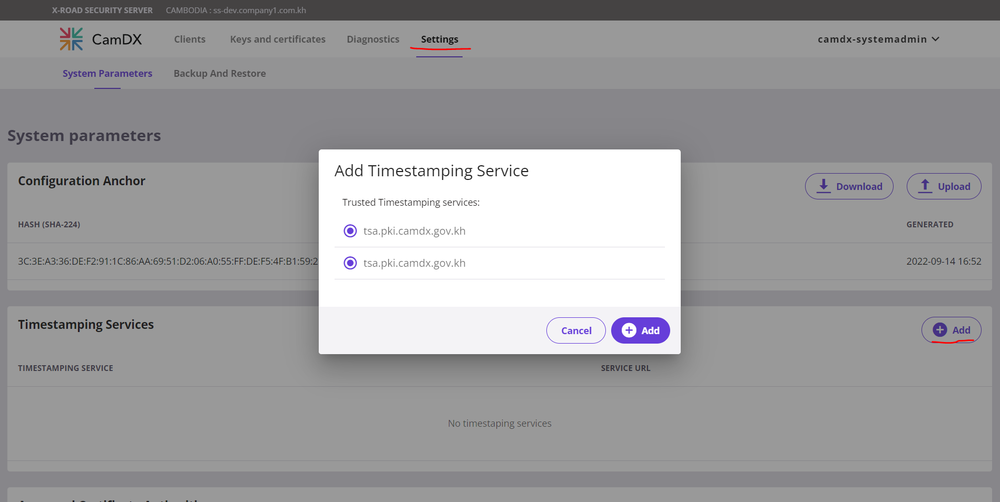
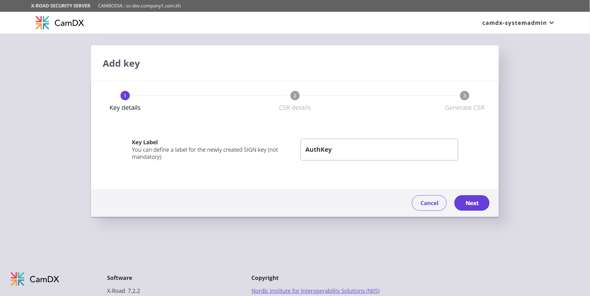
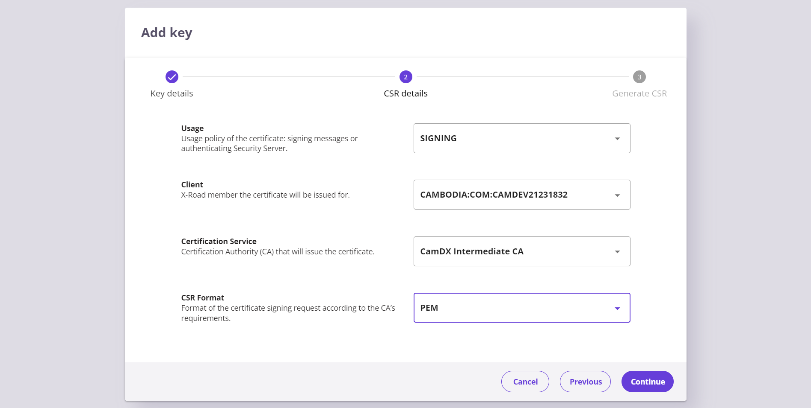
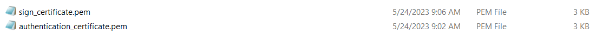
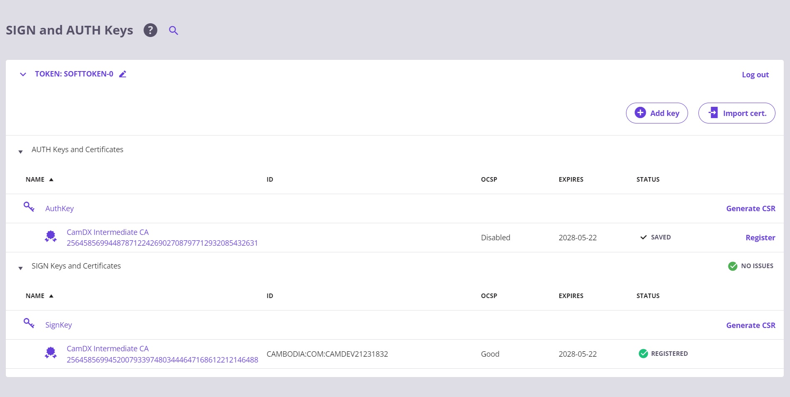
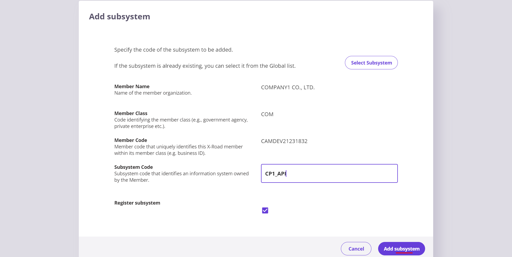

# Security Server Installation Guide for RHEL

X-ROAD 7.2.2

Standalone Security Server Installation and Configuration

## Document version history <!-- omit in toc -->

|Release no|Author|Date|Brief summary of changes|
| :- | :- | :- | :- |
|v1.0.0|CamDX Operator|July 2022||
|v2.0.0|CamDX Operator|May 2023|Update support for RHEL 8.7|

## Table of Contents <!-- omit in toc -->

<!-- toc -->
<!-- vim-markdown-toc GFM -->
- [1. SECURITY SERVER REQUIREMENT](#1-security-server-requirement)

  - [1.1	Hardware Requirement](#11-hardware-requirement)

  - [1.2	Software](#12-software)

  - [1.3	Network Ports](#13-network-ports)

  - [1.4	Network Diagram](#14-network-diagram)

  - [1.5	CamDX Central Authority IPs](#15-camdx-central-authority-ips)

- [2.	INSTALLATION](#2-installation)

  - [2.1	CamDX Security Server Built Packages](#21-camdx-security-server-built-packages)

  - [2.2	Remote Database (Optional)](#22-remote-database-optional)

  - [2.3	Install the Security Server Package](#23-install-the-security-server-package)

  - [2.4	Configure Proxy Ports](#24-configure-proxy-ports)

  - [2.5	Start Security Server](#25-start-security-server)

- [3.	POST INSTALLATION](#3-post-installation)

  - [3.1	Services Check](#31-services-check)
  
  - [3.2 For High-availability Security Server setup with external load balancer and Opmonitor](#32-for-high-availability-security-server-setup-with-external-load-balancer-and-opmonitor)

- [4.	CONFIGURATION](#4-configuration)

  - [4.1	SECURITY SERVER MEMBER INFORMATION](#41-security-server-member-information)

  - [4.2	ACCESS TO SECURITY SERVER ADMIN INTERFACE](#42-access-to-security-server-admin-interface)

  - [4.3	CONFIGURATION ANCHOR](#43-configuration-anchor)

  - [4.4	INITIAL CONFIGURATION](#44-initial-configuration)

  - [4.5	ENTERING THE PIN CODE](#45-entering-the-pin-code)

  - [4.6	CONFIGURING THE TIME-STAMPING SERVICE](#46-configuring-the-time-stamping-service)

  - [4.7	SIGNING AND AUTHENTICATION KEYS](#47-signing-and-authentication-keys)

  - [4.8	IMPORTING THE CERTIFICATES](#48-importing-the-certificates)

  - [4.9	REGISTERING THE AUTHENTICATION CERTIFICATE](#49-registering-the-authentication-certificate)

  - [4.10	ADDING A SUBSYSTEM TO SECURITY SERVER](#410-adding-a-subsystem-to-security-server)

  - [4.11	CONSUME API](#411-consume-api)

- [5.	COMMANDS USED](#5-commands-used)

- [6.	REFERENCES](#6-references)
<!-- vim-markdown-toc -->
<!-- tocstop -->

## 1 SECURITY SERVER REQUIREMENT
### 1.1 Hardware Requirement
- The server’s hardware (motherboard, CPU, network interface cards, storage system) must be supported by RHEL in general
- CPU: 2
- RAM: 4GB
- DISK: 100GB
- Network Card: 100 Mbps
### 1.2 Software
- Operating System: RHEL 8.7 x86-64
- Set the operating system locale. Add following line to the /etc/environment file.
```bash
echo LC_ALL=en_US.UTF-8 | sudo tee -a /etc/environment
```
- Ensure that the packages locales and software-properties-common are present
```bash
sudo yum install yum-utils coreutils -y
```
- Ensure that the timezone is set to Asia/Phnom_Penh – timedatectl
```bash
sudo timedatectl set-timezone Asia/Phnom_Penh
```
- Add Extra Packages for Enterprise Linux (EPEL) repository:
```bash
sudo yum install https://dl.fedoraproject.org/pub/epel/epel-release-latest-8.noarch.rpm -y
```
### 1.3 Network Ports
It is strongly recommended to protect the security server from unwanted access using a firewall (hardware or software based). The firewall can be applied to both incoming and outgoing connections depending on the security requirements of the environment where the security server is deployed. It is recommended to allow incoming traffic to specific ports only from explicitly defined sources using IP filtering. **Special attention should be paid with the firewall configuration since incorrect configuration may leave the security server vulnerable to exploits and attacks.**

The table below lists the required connections between different components.

|Connection Type|Source|Target|Target Ports|Protocol|Note|
| :-: | :-: | :-: | :-: | :-: | :-: |
|Out|Security Server|Central Server|443, 4001|tcp||
|Out|Security Server|Management Security Server|5500, 5577|tcp||
|Out|Security Server|OCSP Service|443|tcp||
|Out|Security Server|Timestamping Service|443|tcp||
|Out|Security Server|Data Exchange Partner Security Server (Service Producer)|5500, 5577|tcp||
|Out|Security Server|Producer Information System|80, 443, other|tcp|Target in the internal network|
|In|Monitoring Security Server|Security Server|5500, 5577|tcp|This is only required in Production|
|In|Data Exchange Partner Security Server (Service Consumer)|Security Server|5500, 5577|tcp||
|In|Consumer Information System|Security Server|8080, 8443|tcp|Source in the internal network|
|In|Admin|Security Server|4000|tcp|Source in the internal network|
|In|Security Server|Opmonitor Server|2080|tcp|Source in the internal network|
<p align="center"> TABLE 1 – NETWORK PORTS </p>

### 1.4 Network Diagram
The network diagram below provides an example of a basic Security Server setup. Allowing incoming connections from the Monitoring Security Server on ports 5500/tcp and 5577/tcp is necessary for the CamDX Operator to be able to monitor the ecosystem and provide statistics and support for Members.


<p align="center"> FIGURE 1 – NETWORK DIAGRAM </p>

### 1.5 CamDX Central Authority IPs 


|Type|CamDX - Production|CamDX - Development|
| :- | :- | :- |
|Central Server|103.63.190.230 (4001 & 443/tcp)	<br>103.63.190.232 (4001 & 443/tcp)	|206.189.151.1 (4001 & 443/tcp) <br>103.63.190.238 (4001 & 443/tcp)|
|Central Monitoring Server|103.63.190.227	(5500 & 5577/tcp)||
|Management Security Server|103.63.190.231 (5500 & 5577/tcp) <br>103.63.190.233	(5500 & 5577/tcp)|103.118.47.131 (5500 & 5577/tcp)|
|Timestamping Service|103.63.190.229 (443/tcp)|103.216.51.117 (10000/tcp)|
|OCSP Service|103.63.190.229 (443/tcp)|103.216.51.117 (10000/tcp)|

## 2 INSTALLATION
### 2.1 CamDX Security Server Built Packages
- Add Repository to /etc/apt/sources.list:
```bash
sudo yum-config-manager --add-repo https://repository.camdx.gov.kh/repository/camdx-release-rpm/rhel/8/7.2.2
```
- Add Signing Key:
```bash
sudo rpm --import https://repository.camdx.gov.kh/repository/camdx-anchors/api/gpg/key/0x04194DBF-pub.asc
```
- Update package repository metadata:
```
sudo yum update
```
### 2.2 Remote Database (Optional)
*This is an optional step.*

- Optionally, the security server can use a remote database server. To avoid installing the default local PostgreSQL server during security server installation, first install the `xroad-database-remote`-package:
```bash
sudo yum install xroad-database-remote
```
- Verify connection to the remote PostgreSQL: (pay close attention to their version)
```bash
psql --version       #psql (PostgreSQL) 10.23
psql -h <database host> -U <superuser> -tAc 'show server_version'
#Make sure 'postgresql-contrib' is installed at the remote database
```
- Create the property file for database credentials:
```bash
sudo touch /etc/xroad.properties
sudo chown root:root /etc/xroad.properties
sudo chmod 600 /etc/xroad.properties
sudo vi /etc/xroad.properties
```
```bash
postgres.connection.password = <database superuser password>
postgres.connection.user = <database superuser name, postgres by default>
```
```bash
sudo touch /etc/xroad/db.properties
sudo chmod 0640 /etc/xroad/db.properties
sudo chown xroad:xroad /etc/xroad/db.properties
sudo vi /etc/xroad/db.properties
```
```bash
serverconf.hibernate.connection.url = jdbc:postgresql://<remote-db_IP>:5432/serverconf 
messagelog.hibernate.connection.url = jdbc:postgresql://<remote-db_IP>:5432/messagelog 
```

### 2.3 Install the Security Server Package
- Issue the following command to install the security server packages
```bash
sudo yum install xroad-securityserver
```
- Add system user whom all roles in the user interface are granted to:
```bash
sudo xroad-add-admin-user camdx-systemadmin
```
- More on User management at https://github.com/nordic-institute/X-Road/blob/develop/doc/Manuals/ug-ss_x-road_6_security_server_user_guide.md#2-user-management 

### 2.4 Configure Proxy Ports
- This is an optional step. Change 'xroad-proxy' to use ports 80 and 443

By default, xroad-proxy listens for consumer information system connections on port 8080 (HTTP) and 8443 (HTTPS). To use stadard HTTP(S) ports 80 and 443, verify that the ports are free, and make the following modifications:

Edit '/etc/xroad/conf.d/local.ini and add the following properties in the [proxy] section:
```bash
[proxy]
client-http-port=80
client-https-port=443
```
### 2.5 Start Security Server
- Once the installation is completed, start the security server
```bash
sudo systemctl start xroad-proxy
```

## 3 POST-INSTALLATION
### 3.1 Services Check
The installation is successful if system services are started and the user interface is responding.
- Ensure from the command line that X-Road services are in the running state (example output follows):

```bash
sudo systemctl list-units "xroad-*"

  - UNIT                              LOAD   	ACTIVE 	  SUB     	DESCRIPTION
  - xroad-addon-messagelog.service    loaded    active    running       X-Road Messagelog Archiver
  - xroad-base.service                loaded    active    exited        X-Road initialization
  - xroad-confclient.service 	      loaded 	active 	  running 	X-Road confclient
  - xroad-monitor.service    	      loaded 	active 	  running 	X-Road Monitor
  - xroad-proxy-ui-api.service        loaded    active    running       X-Road Proxy UI REST API
  - xroad-proxy.service      	      loaded 	active 	  running 	X-Road Proxy
  - xroad-signer.service     	      loaded 	active 	  running 	X-Road signer
```
### Disable Message Body Logging
```
sudo vim /etc/xroad/conf.d/local.ini
```
Create the [message-log] section (if not present) in the file
```
[message-log]
message-body-logging = false
```
```
sudo systemctl restart "xroad-*"
```
(skip this 3.2 if you're installing a standalone security server)

### 3.2 For High-availability Security Server setup with external load balancer and Opmonitor

Install xroad-addon-proxymonitor & xroad-addon-opmonitoring on both Master and Slave Security Server node then proceed to [rhel_high_availability_security_server_installation_with_external_load_balancer.md](https://github.com/Techo-Startup-Center/CamDX-Documentation/blob/main/rhel_high_availability_security_server_installation_with_external_load_balancer.md)
```bash
sudo yum install xroad-addon-proxymonitor
sudo yum install xroad-addon-opmonitoring
sudo systemctl restart xroad-opmonitor
```

Allow access for webadmin:
```bash
sudo firewall-cmd --zone=public --add-port=4000/tcp --permanent
sudo firewall-cmd --reload
```

Ensure that the security server user interface at <https://SECURITYSERVER_IP:4000> can be opened in a Web browser. To log in, use the account name chosed during the installation. The web browser may display a connection refused error while the user interface is still starting up.

## 4 CONFIGURATION
### 4.1 SECURITY SERVER MEMBER INFORMATION
- Member Information will be provided by CamDX Central Authority as part of the member registration process

||Member Information|
|-|-|
|Member Name|COMPANY1 CO., LTD. |
|Member Class|COM|
|Member Code|CAMDEV21231832|

TABLE 2 – MEMBER INFORMATION IN PRODUCTION ENVIRONMENT

- Member Name in this example is Company1 Co., Ltd.
- Member Code will be provided
### 4.2 ACCESS TO SECURITY SERVER ADMIN INTERFACE
- URL: 	<https://SECURITY_SERVER_IP:4000> 
- ID: 		camdx-systemadmin or <YOUR_SYSTEMADMINUSER>
- Password: 	<YOUR_PASSWORD>
### 4.3 CONFIGURATION ANCHOR
- The Configuration Anchor file can be downloaded from:


|ENVIRONMENT||
| :- | :- |
|[DEV](https://repository.camdx.gov.kh/repository/camdx-anchors/anchors/dev/CAMBODIA_configuration_anchor_dev.xml)|https://repository.camdx.gov.kh/repository/camdx-anchors/anchors/dev/CAMBODIA_configuration_anchor_dev.xml|
|[PRODUCTION](https://repository.camdx.gov.kh/repository/camdx-anchors/anchors/CAMBODIA_configuration_anchor.xml)|https://repository.camdx.gov.kh/repository/camdx-anchors/anchors/CAMBODIA_configuration_anchor.xml|

When uploading, the Security Server will check the connection to Central Security's address specified in Anchor file
- Upload the Configuration Anchor File


<p align="center"> FIGURE 8 – IMPORT CONFIGURATION ANCHOR FILE </p>


### 4.4 INITIAL CONFIGURATION
With the provided Member Information, fill out the initial configuration page


|PRODUCTION ENVIRONMENT||
|-|-|
|Member Name|COMPANY1 CO., LTD.|
|Member Class|COM|
|Member Code|CAMDEV21231832|

<p align="center"> FIGURE 9 – INITIAL CONFIGURATION </p>

### 4.5 ENTERING THE PIN CODE

Enter the PIN Code (Software Token) from the Initial Configuration. Click on the “Please enter softtoken PIN” or Navigate through the top panel – Keys and Certificates, on TOKEN - Login to enter the PIN.


<p align="center"> FIGURE 10 – ENTER PIN CODE </p>


<p align="center"> FIGURE 11 – ENTER PIN CODE 2 </p>


<p align="center"> FIGURE 12 – ENTER PIN CODE 3 </p>

### 4.6 CONFIGURING THE TIME-STAMPING SERVICE
- Settings => Timestamping Services => Add
- Pick time-stamping service from the list
- Add



<p align="center"> FIGURE 13 – TIMESTAMPING SERVICE </p>

### 4.7 SIGNING AND AUTHENTICATION KEYS
#### **Authentication Key**
- Keys and certificates:
  - Select Token: **SOFTTOKEN-0**
  - **Add Key**
  - Type Label **AuthKey**
  - Press **Next**
- CSR details:
  - Usage: **AUTHENTICATION**
  - Certification Service: **CAMDX INTERMEDIATE CA**
  - CSR Format: **PEM**
  - **Continue**
- Generate CSR:
  - Specify Server DNS name (CN): **ss-dev.company1.com.kh**
  - Specify Organization Name (O): **COMPANY1 CO LTD**
  - **Generate CSR**


<p align="center"> FIGURE 14 – GENERATING AUTH CERTIFICATE PRIVATE KEY </p>



<p align="center"> FIGURE 15 – GENERATING AUTH CERTIFICATE SIGNING REQUEST </p>


<p align="center"> FIGURE 16 – GENERATING AUTH CERTIFICATE SIGNING REQUEST 2 </p>

#### **Signing Key**
- Keys and certificates:
  - Select Token: **SOFTTOKEN-0**
  - **Add Key**
  - Type Label **SignKey**
  - Press **Next**
- CSR details:
  - Usage: **SIGNING**
  - Client: **CAMBODIA:COM:CAMDEV21231831**
  - Certification Service: **CAMDX INTERMEDIATE CA**
  - CSR Format: **PEM**
  - **Continue**
- Generate CSR:
  - Specify Organization Name (O): **COMPANY1 CO LTD**
  - **Generate CSR**


<p align="center"> FIGURE 17 – GENERATING SIGN CERTIFICATE PRIVATE KEY </p>



<p align="center"> FIGURE 18 – GENERATING SIGN CERTIFICATE SIGNING REQUEST </p>


<p align="center"> FIGURE 19 – GENERATING SIGN CERTIFICATE SIGNING REQUEST 2 </p>


#### **Sending the AuthKey and SignKey CSR to CamDX**

- Contact and Send the CSR Files of “AuthKey”, and “SignKey” to CamDX Central Authority
- Then the CamDX Central Authority will issue the Authentication Certificate and Signing Certificate.


<p align="center"> FIGURE 20 – CERTIFICATE SIGNING REQUESTS </p>



<p align="center"> FIGURE 21 – ISSUED CERTIFICATES RECEIVED </p>

### 4.8 IMPORTING THE CERTIFICATES
- Keys and certificates
  - **Import cert.**
  - **Browse**
  - **Open**


<p align="center"> FIGURE 22 – IMPORT CERTIFICATES </p>



<p align="center"> FIGURE 23 – STATUS AFTER BOTH CERTIFICATES IMPORTED </p>

- The Auth Certificate is disabled by default, so we need to activate it:
  - Select the recently imported Auth Certificate
  - Press **ACTIVATE**


<p align="center"> FIGURE 24 – ACTIVATE AUTH CERTIFICATE </p>

### 4.9 REGISTERING THE AUTHENTICATION CERTIFICATE
- Select the Auth Certificate
  - Press **REGISTER**
  - Enter **FQDN  (ss-dev.company1.com.kh)**
  - Press **OK** to submit request


<p align="center"> FIGURE 25 – SEND REGISTRATION REQUEST </p>

- Status after the request showing status "registration in progress"


<p align="center"> FIGURE 26 – STATUS REGISTRATION IN PROGRESS </p>

- After the CamDX Central Authority approved the request.


<p align="center"> FIGURE 27 – STATUS AFTER THE APPROVAL </p>

- Double-click on the newly approved subystem "CP1_API" => Internal Servers => Switch to HTTP

### 4.10 ADDING A SUBSYSTEM TO SECURITY SERVER

A subsystem named "**CP1_API**" will added and used as a client to consume service.

- **Clients** => **COMPANY1 CO LTD** => **Add subsystem**
  - Subsystem Code: **CP1_API**
  - Press **Add subsystem**


<p align="center"> FIGURE 28 – ADD A SUBSYSTEM </p>



<p align="center"> FIGURE 31 – ADD A SUBSYSTEM 2 </p>


<p align="center"> FIGURE 32 – ADD A SUBSYSTEM 3 </p>


The status will turn GREEN **"REGISTERED"** after the it is approved by the authority.

### 4.11 CONSUME API


<p align="center"> FIGURE 47 – ACCESSING OPEN_API </p>

- POST http://ss-dev.company1.com.kh/r1/CAMBODIA/GOV/CAMDX-20201222/CAMDIGIKEY_KYC/servicecode
- Header: X-Road-Client: CAMBODIA/COM/CAMDEV21231832/CP1_API


<p align="center"> FIGURE 48 – CONSUMING API </p>

- http(s)://ss-dev.company1.com.kh/r1/ => Request via Security Server that was allowed by the data exchange partner
- **CAMBODIA/COM/CAMDX-20201222/CAMDIGIKEY_KYC/servicecode** => This is provided by the service provider
- X-Road-Client: **CAMBODIA/COM/CAMDEV21231832/CP1_API** => Client ID

Refer to the API specification documents for more information!

## 5 COMMANDS USED
```bash
sudo vi /etc/environment
```
```bash
LC_ALL=en_US.UTF-8
```
```bash
sudo yum update
sudo yum install yum-utils coreutils
sudo timedatectl set-timezone Asia/Phnom_Penh
sudo yum install https://dl.fedoraproject.org/pub/epel/epel-release-latest-8.noarch.rpm
sudo yum-config-manager --add-repo https://repository.camdx.gov.kh/repository/camdx-release-rpm/rhel/8/7.2.2
sudo rpm --import https://repository.camdx.gov.kh/repository/camdx-anchors/api/gpg/key/0x04194DBF-pub.asc
```
```bash
sudo yum update
sudo yum install xroad-securityserver
sudo xroad-add-admin-user <username>
sudo vi /etc/xroad/conf.d/local.ini
```
```bash
[proxy]
client-http-port=80
client-https-port=443
```
```bash
sudo systemctl list-units "xroad-*"
```
## 6 REFERENCES

X-Road/ig-ss_x-road_v6_security_server_installation_guide_for_rhel.md at camdx-6.23.0 · CamDX/X-Road. (2022). Retrieved 26 May 2022, from <https://github.com/Techo-Startup-Center/CamDX/blob/camdx-6.23.0/doc/Manuals/ig-ss_x-road_v6_security_server_installation_guide_for_rhel.md>
