# STANDALONE SECURITY SERVER INSTALLATION AND CONFIGURATION

July 2022

Standalone Security Server Installation and Configuration

## Document version history <!-- omit in toc -->

|Release no|Author|Date|Brief summary of changes|
| :- | :- | :- | :- |
|v1.0.0|Camdx Operator|July 2022||

## Table of Contents <!-- omit in toc -->

<!-- toc -->
<!-- vim-markdown-toc GFM -->
- [1. SECURITY SERVER REQUIREMENT](#1-security-server-requirement)

  - [1.1	Hardware Requirement](#11-hardware-requirement)

  - [1.2	Software](#12-software)

  - [1.3	Network Ports](#13-network-ports)

  - [1.4	Network Diagram](#14-network-diagram)

  - [1.5	CamDX Central Authority IP for Whitelisting](#15-camdx-central-authority-ip-for-whitelisting)

- [2.	INSTALLATION](#2-installation)

  - [2.1	CamDX Security Server Built Packages](#21-camdx-security-server-built-packages)

  - [2.2	Remote Database (Optional)](#22-remote-database-(optional))

  - [2.3	Install the CamDX Package](#23-install-the-camdx-package)

- [3.	POST INSTALLATION](#3-post-installation)

  - [3.1	Services Check](#31-services-check)

- [4.	CONFIGURATION](#4-configuration)

  - [4.1	SECURITY SERVER MEMBER INFORMATION](#41-security-server-member-information)

  - [4.2	ACCESS TO SECURITY SERVER ADMIN INTERFACE](#42-access-to-security-server-admin-interface)

  - [4.3	CONFIGURATION ANCHOR](#43-configuration-anchor)

  - [4.4	INITIAL CONFIGURATION](#44-initial-configuration)

  - [4.5	ENTERING THE PIN CODE](#45-entering-the-pin-code)

  - [4.6	CONFIGURING THE TIME-STAMPING SERVICE](#46-configuring-the-time-stamping-service)

  - [4.7	Sign and Auth Certificates](#47-sign-and-auth-certificates)

  - [4.8	Importing the certificates](#48-importing-the-certificates)

  - [4.9	REGISTERING THE AUTHENTICATION CERTIFICATE](#49-registering-the-authentication-certificate)

  - [4.10	ADDING A SUBSYSTEM TO SECURITY SERVER](#410-adding-a-subsystem-to-security-server)

  - [4.11	ADDING CERTIFICATE FOR TLS CONNECTION BETWEEN INFORMATION SYSTEM AND SECURITY SERVER](#411-adding-certificate-for-tls-connection-between-information-system-and-security-server)

  - [4.12	ADDING A NEW SERVICE TO THE SUBSYSTEM](#412-adding-a-new-service-to-the-subsystem)

  - [4.13	ADDING CERTIFICATE FOR TLS CONNECTION BETWEEN CONSUMER SYSTEM AND SECURITY SERVER](#413-adding-certificate-for-tls-connection-between-consumer-system-and-security-server)

  - [4.14	ACCESS THE OPEN API](#414-access-the-open-api)

- [5.	COMMANDS USED](#5-commands-used)

- [6.	REFERENCES](#6-references)
<!-- vim-markdown-toc -->
<!-- tocstop -->

## 1 SECURITY SERVER REQUIREMENT
### 1.1 Hardware Requirement
- CPU: 64-bit dual-core Intel
- RAM: 4GB
- Network Card: 100 Mbps
### 1.2 Software
- Operating System: Ubuntu 18.04 LTS x86-64
  - Add System User 
```bash
sudo adduser camdx-systemadmin
```
- Set the operating system locale.
  - Add following line to the /etc/environment.
```bash
LC_ALL=en_US.UTF-8
```
- Ensure that the packages locales and software-properties-common are present
```bash
sudo apt-get install locales software-properties-common
```
- Ensure that the timezone is set to Asia/Phnom_Penh – timedatectl
```bash
sudo timedatectl set-timezone Asia/Phnom_Penh
```
### 1.3 Network Ports
It is strongly recommended to protect the security server from unwanted access using a firewall (hardware or software based). The firewall can be applied to both incoming and outgoing connections depending on the security requirements of the environment where the security server is deployed. It is recommended to allow incoming traffic to specific ports only from explicitly defined sources using IP filtering. Special attention should be paid with the firewall configuration since incorrect configuration may leave the security server vulnerable to exploits and attacks.

The table below lists the required connections between different components.

|Connection Type|Source|Target|Target Ports|Protocol|Note|
| :-: | :-: | :-: | :-: | :-: | :-: |
|Out|Security Server|Central Server|80, 4001|tcp||
|Out|Security Server|Management Security Server|5500, 5577|tcp||
|Out|Security Server|OCSP Service|80 / 443|tcp||
|Out|Security Server|Timestamping Service|80 / 443|tcp||
|Out|Security Server|Data Exchange Partner Security Server (Service Producer)|5500, 5577|tcp||
|Out|Security Server|Producer Information System|80, 443, other|tcp|Target in the internal network|
|In|Monitoring Security Server|Security Server|5500, 5577|tcp||
|In|Data Exchange Partner Security Server (Service Consumer)|Security Server|5500, 5577|tcp||
|In|Consumer Information System|Security Server|80, 443|tcp|Source in the internal network|
|In|Admin|Security Server|4000|tcp|Source in the internal network|

<p align="center"> TABLE 1 – NETWORK PORTS </p>

### 1.4 Network Diagram
The network diagram below provides an example of a basic Security Server setup. Allowing incoming connections from the Monitoring Security Server on ports 5500/tcp and 5577/tcp is necessary for the CamDX Operator to be able to monitor the ecosystem and provide statistics and support for Members.


<p align="center"> FIGURE 1 – NETWORK DIAGRAM </p>

### 1.5 CamDX Central Authority IP for Whitelisting


|Type|CamDX - Production|CamDX - Dev|
| :- | :- | :- |
|Central Server|103.63.190.230	<br>103.63.190.232	|206.189.151.1|
|Central Monitoring Server|103.63.190.227	||
|Management Security Server|103.63.190.231	<br>103.63.190.233	|178.128.122.111|

## 2 INSTALLATION
### 2.1 CamDX Security Server Built Packages
- Add Repository to /etc/apt/sources.list:
```bash
echo deb [arch=all,amd64] http://repository.camdx.gov.kh/repository/camdx-release bionic main | sudo tee -a /etc/apt/sources.list
```
- Add Signing Key:
```bash
curl http://repository.camdx.gov.kh/repository/camdx-anchors/api/gpg/key/0x04194DBF-pub.asc | sudo apt-key add -
```
### 2.2 Remote Database (Optional)
if you want to use remote database server instead of the default locally installed one, you need to pre-create configuration file containing the database administrator master password. This can be done by performing the following steps:
```bash
sudo touch /etc/xroad.properties
sudo chown root:root /etc/xroad.properties
sudo chmod 600 /etc/xroad.properties
```
Edit /etc/xroad.properties contents.
```bash
postgres.connection.password = 54F46A19E50C11DA8631468CF09BE5DB
```
### 2.3 Install the CamDX Package
```bash
sudo apt-get update
sudo apt-get install xroad-securityserver
```
Upon the first installation of the packages, the system asks for the following information.

- Account name for the user who will be granted the rights to perform all activities in the user interface
- Database server URL. Locally installed database is suggested as default but remote databases can be used as well. In case remote database is used, one should verify that the version of the local PostgreSQL client matches the version of the remote PostgreSQL Server.
- The Distinguished Name of the owner of the user interface’s and management REST API’s self-signed TLS certificate(Subject DN) and its alternative names (subjectAltName)

Account name for the user who will be granted the rights to perform all activities in the user interface


<p align="center"> FIGURE 2 – SPECIFY SUPERADMIN USER </p>

Database server URL. Locally installed database is suggested as default, but remote databases can be used as well.


<p align="center"> FIGURE 3 – LOCAL DATABASE CONNECTION STRING </p>

The Distinguished Name of the owner of the user interface’s and management REST API’s self-signed TLS certificate(Subject DN) and its alternative names

E.g: /C=KH/O=EXAMPLE MINISTRY or COMPANY/OU=ICT Department/CN=HOSTNAME or FQDN or IP


<p align="center"> FIGURE 4 – TLS CERTIFICATE </p>

The Distinguished Name of the owner of the user interface’s and management REST API’s self-signed TLS certificate(Subject DN) and its alternative names

E.g: /C=KH/O=EXAMPLE MINISTRY or COMPANY/OU=ICT Department/CN=HOSTNAME or FQDN or IP


<p align="center"> FIGURE 5 – TLS CERTIFICATE 2 </p>

The Distinguished Name of the owner of the TLS certificate that is used for securing the HTTPS access point of information systems. The name and IP addresses detected from the system are suggested as default values.


<p align="center"> FIGURE 6 – INTERNAL SERVICE TLS CERTIFICATE </p>

The Distinguished Name of the owner of the TLS certificate that is used for securing the HTTPS access point of information systems. The name and IP addresses detected from the system are suggested as default values.


<p align="center"> FIGURE 7 – INTERNAL SERVICE TLS CERTIFICATE </p>


## 3 POST-INSTALLATION
### 3.1 Services Check
```bash
sudo systemctl list-units "xroad-*"

  - UNIT                     		LOAD   	ACTIVE 	SUB     	DESCRIPTION
  - xroad-confclient.service 	loaded 	active 		running 	X-Road confclient
  - xroad-jetty.service      	loaded 	active 		running 	X-Road Jetty server
  - xroad-monitor.service    	loaded 	active 		running 	X-Road Monitor
  - xroad-proxy.service      	loaded 	active 		running 	X-Road Proxy
  - xroad-signer.service     	loaded 	active 		running 	X-Road signer
```
Install xroad-addon-proxymonitor & xroad-addon-opmonitoring
```bash
sudo apt install xroad-addon-proxymonitor
sudo apt install xroad-addon-opmonitoring
sudo systemctl restart xroad-opmonitor
```
Ensure that the security server user interface at <https://SECURITYSERVER_IP:4000> can be opened in a Web browser.

## 4 CONFIGURATION
### 4.1 SECURITY SERVER MEMBER INFORMATION
- Member Information will be provided by CamDX Central Authority


|DEVELOPMENT ENVIRONMENT||
|-|-|
|Member Name|Techo Startup Center |
|Member Class|GOV|
|Member Code|DEV00001|

TABLE 2 – MEMBER INFORMATION IN DEVELOPMENT ENVIRONMENT


|PRODUCTION ENVIRONMENT||
|-|-|
|Member Name|COMPANY1 CO., LTD. |
|Member Class|COM|
|Member Code|PRO00001|

TABLE 3 – MEMBER INFORMATION IN PRODUCTION ENVIRONMENT

- Member Name in this example are Techo Startup Center and Company1 Co., Ltd.
- Member Code will be provided
### 4.2 ACCESS TO SECURITY SERVER ADMIN INTERFACE
- URL: 	<https://SECURITY_SERVER_IP:4000> 
- ID: 		camdx-systemadmin or <YOUR_USERSYSTEMADMIN>
- Password: 	<YOUR_PASSWORD>
### 4.3 CONFIGURATION ANCHOR
- The Anchor Configuration file will be provided by CamDX Central Authority 
- You can download it from here:


|ENVIRONMENT||
| :- | :- |
|[DEV](http://repository.camdx.gov.kh/repository/camdx-anchors/anchors/dev/CAMBODIA_configuration_anchor_dev.xml)|http://repository.camdx.gov.kh/repository/camdx-anchors/anchors/dev/CAMBODIA_configuration_anchor_dev.xml|
|[PRODUCTION](http://repository.camdx.gov.kh/repository/camdx-anchors/anchors/CAMBODIA_configuration_anchor.xml)|http://repository.camdx.gov.kh/repository/camdx-anchors/anchors/CAMBODIA_configuration_anchor.xml|

- Upload the Configuration Anchor File

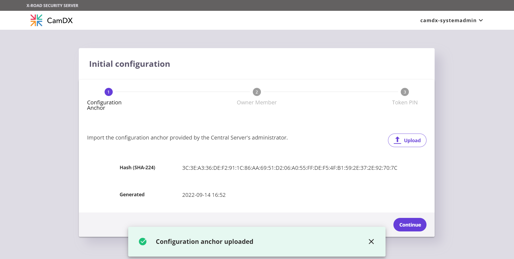

<p align="center"> FIGURE 8 – IMPORT CONFIGURATION ANCHOR FILE </p>


### 4.4 INITIAL CONFIGURATION
With the provided Member Information, fill out the initial configuration page


|PRODUCTION ENVIRONMENT||
|-|-|
|Member Name|COMPANY1 CO., LTD.|
|Member Class|COM|
|Member Code|PRO00001|

<p align="center"> FIGURE 9 – INITIAL CONFIGURATION </p>

### 4.5 ENTERING THE PIN CODE

Enter the PIN Code (Software Token) from the Initial Configuration. Click on the “Please enter softtoken PIN” or Navigate through the left panel – Management – Keys and Certificates, to enter the PIN.


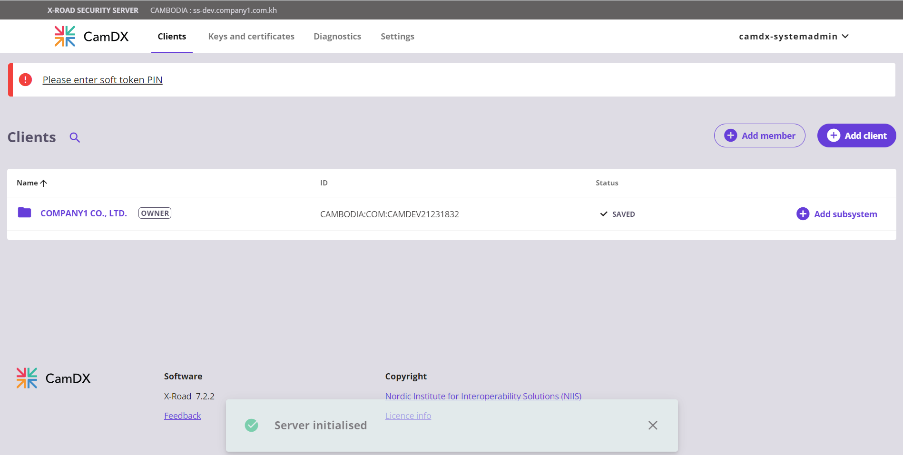

<p align="center"> FIGURE 10 – ENTER PIN CODE </p>


<p align="center"> FIGURE 11 – ENTER PIN CODE 2 </p>


<p align="center"> FIGURE 12 – ENTER PIN CODE 3 </p>

### 4.6 CONFIGURING THE TIME-STAMPING SERVICE
- Choose System Parameter => Timestamping Services => ADD
- Pick time-stamping service from the list
- Press OK


<p align="center"> FIGURE 13 – TIMESTAMPING SERVICE </p>

### 4.7 Sign and Auth Certificates
#### **Auth Certificate**
- Generate Auth Certificate Private Key
  - Open Keys and Certificates
  - Select Token: **softToken-0**
  - Press **GENERATE KEY**
  - Type Label **AuthKey**
  - Press **OK**
- Generate Auth Certificate Signing Request
  - Select **AuthKey**
  - Press **GENERATE CSR**
  - Choose Usage: **AUTH**
  - Choose Certification Service: **CAMDX INTERMEDIATE CA**
  - CSR Format: **PEM**
  - Press **OK**
  - Specify Organization Name (O): **COMPANY1 CO LTD**
  - Specify Server DNS name (CN): **ss1.company1.com**

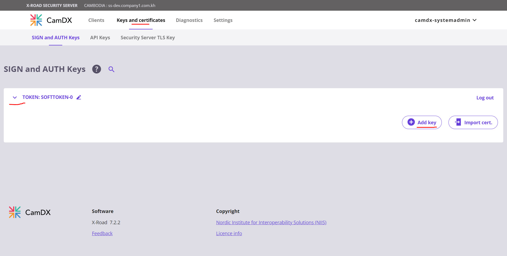

<p align="center"> FIGURE 14 – GENERATING AUTH CERTIFICATE PRIVATE KEY </p>


<p align="center"> FIGURE 15 – GENERATING AUTH CERTIFICATE SIGNING REQUEST </p>


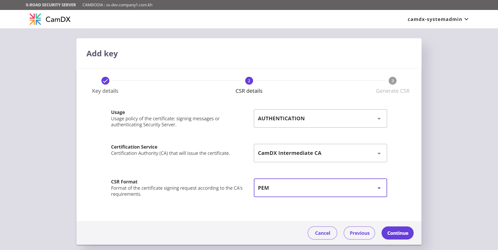

<p align="center"> FIGURE 16 – GENERATING AUTH CERTIFICATE SIGNING REQUEST 2 </p>

#### **Sign Certificate**
- Generate Sign Certificate Signing Request
  - Open Keys and Certificates
  - Select Token: **softToken-0**
  - Press **GENERATE KEY**
  - Type Label **SignKey**
  - Press **OK**
- Generate Auth Certificate Signing Request
  - Select **SignKey**
  - Press **GENERATE CSR**
  - Choose Usage: **SIGN**
  - Choose Certification Service: **CAMDX INTERMEDIATE CA**
  - CSR Format: **PEM**
  - Press **OK**
  - Specify Organization Name (O): **COMPANY1 CO LTD**
  - Specify Server DNS name (CN): **ss1.company1.com**

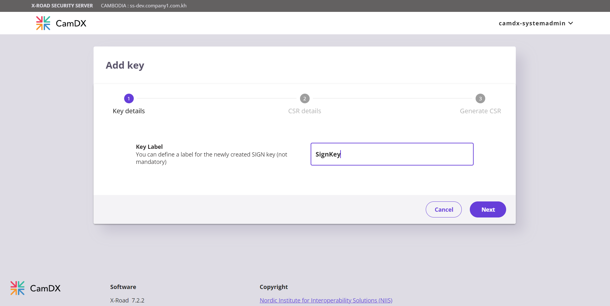

<p align="center"> FIGURE 17 – GENERATING SIGN CERTIFICATE PRIVATE KEY </p>


<p align="center"> FIGURE 18 – GENERATING SIGN CERTIFICATE SIGNING REQUEST </p>

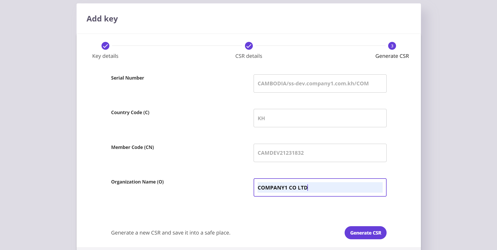

<p align="center"> FIGURE 19 – GENERATING SIGN CERTIFICATE SIGNING REQUEST 2 </p>


#### **Sending the AuthKey and SignKey CSR to CamDX**

- Contact and Send the CSR Files of “AuthKey”, and “SignKey” to CamDX Central Authority
- Then the CamDX Central Authority will issue the Auth Certificate and Sign Certificate.

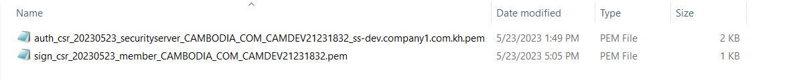

<p align="center"> FIGURE 20 – CERTIFICATE SIGNING REQUESTS </p>


<p align="center"> FIGURE 21 – ISSUED CERTIFICATES RECEIVED </p>

### 4.8 Importing the certificates
- Select the Certificate request under the auth key
  - Press **IMPORT CERTIFICATE**
  - Press **Browse**
  - Press **OK**


<p align="center"> FIGURE 22 – IMPORT AUTH CERTIFICATE </p>

- Select the Certificate request under the sign key
  - Press **IMPORT CERTIFICATE**
  - Press **Browse**
  - Press **OK**


<p align="center"> FIGURE 23 – IMPORT SIGN CERTIFICATE </p>


<p align="center"> FIGURE 24 – STATUS AFTER BOTH CERTIFICATES IMPORTED </p>

- The Auth Certificate is disabled by default, so we need to activate it:
  - Select the recently imported Auth Certificate
  - Press **ACTIVATE**


<p align="center"> FIGURE 25 – ACTIVATE AUTH CERTIFICATE </p>

### 4.9 REGISTERING THE AUTHENTICATION CERTIFICATE
- Select the Auth Certificate
  - Press **REGISTER**
  - Enter **FQDN  (ss1.company1.com)**
  - Press **OK** to submit request

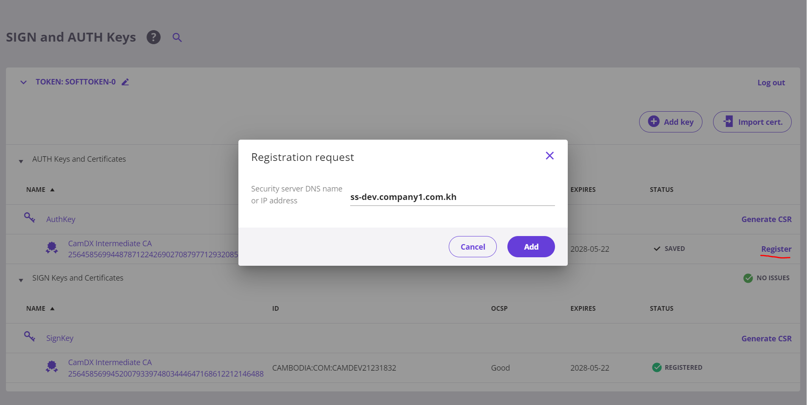

<p align="center"> FIGURE 26 – SEND REGISTRATION REQUEST </p>

- Status after the request showing status "registration in progress"

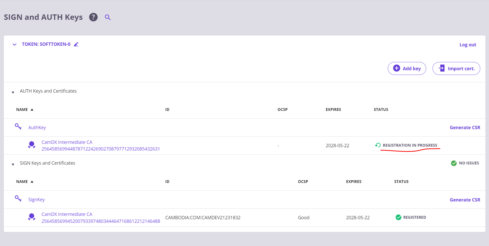

<p align="center"> FIGURE 27 – STATUS REGISTRATION IN PROGRESS </p>

- Status of the Security Server Client is YELLOW while waiting for the approval.


<p align="center"> FIGURE 28 – STATUS PENDING APPROVAL </p>

- After the CamDX Central Authority approved the request, the status of the Security Server Client will turn GREEN.

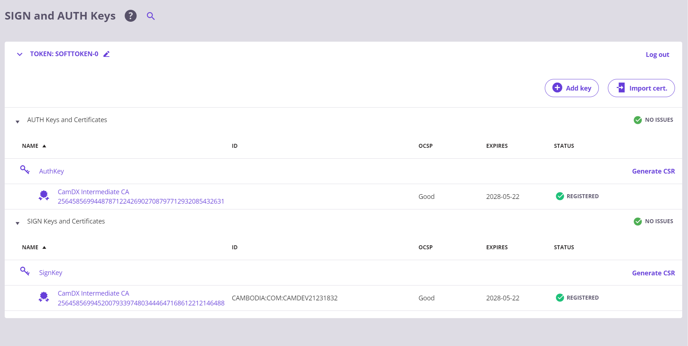

<p align="center"> FIGURE 29 – STATUS AFTER THE APPROVAL </p>

### 4.10 ADDING A SUBSYSTEM TO SECURITY SERVER

For demonstration purpose, there will be two subsystems added to the security server. A subsystem named "**OPEN_API**" will act as a service provider sharing its API while another subsystem named "**CONSUMER**" will be the one to added to the ACL allowing access to the shared API.

- Open Security Server Clients
  - Press **ADD CLIENT**
  - Press **SELECT CLIENT FROM GLOBAL LIST**
  - Press **SEARCH**
  - Select **Member**
  - Press **OK**


<p align="center"> FIGURE 30 – ADD A SUBSYSTEM </p>


<p align="center"> FIGURE 31 – ADD A SUBSYSTEM 2 </p>

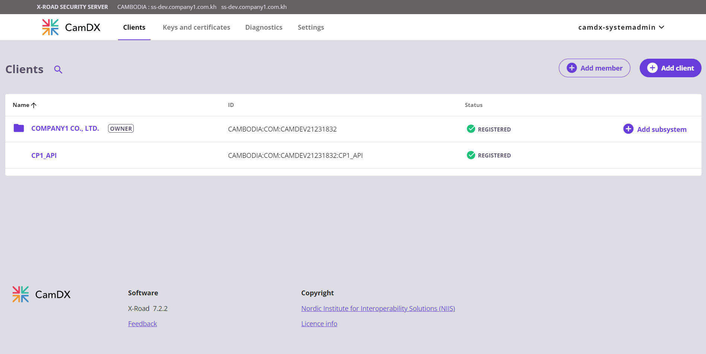

<p align="center"> FIGURE 32 – ADD A SUBSYSTEM 3 </p>


<p align="center"> FIGURE 33 – ADD A SUBSYSTEM 4 </p>

In this scenario, the subsystem is a service provider sharing their "**OPEN_API**" (the subsystem code is provided by CamDX Central Authority) to the other CamDX member. The status is YELLOW pending approval from the CamDX Central Authority and will turn GREEN after the approval.

Repeat adding the subsystem "**CONSUMER**".


<p align="center"> FIGURE 34 – ADD A SUBSYSTEM 5 </p>

### 4.11 ADDING CERTIFICATE FOR TLS CONNECTION BETWEEN INFORMATION SYSTEM AND SECURITY SERVER

For demonstration, the open api to expose will be <https://pumiapp.herokuapp.com/pumi/provinces> so we download their certificate and upload to security server.

The Certificate of the Information System will need to be uploaded to the Security Server’s Subsystem named "**OPEN_API**" for TLS connection.


<p align="center"> FIGURE 35 – ADDING TLS CERTIFICATE FOR INFORMATION SYSTEM </p>


- Open Security Server Clients
  - Select **SUBSYSTEM**
  - Click **Internal Servers**
  - Press **ADD** at **INTERNAL TLS CERTIFICATES**


<p align="center"> FIGURE 36 – UPLOAD INFORMATION SYSTEM CERTIFICATE </p>

### 4.12 ADDING A NEW SERVICE TO THE SUBSYSTEM
- Open Security Server Clients
  - Select **SUBSYSTEM**
  - Click **SERVICES**
    - Press **ADD REST**
    - Enter **URL & SERVICE CODE**
    - Press **OK**


<p align="center"> FIGURE 37 – ADDING A SERVICE TO SUBSYSTEM </p>

- Select SERVIC CODE => Press **ENABLE**


<p align="center"> FIGURE 38 – ENABLING SERVICE </p>

- Click **+** to expand
  - Select SERVICE CODE – **"heroku"**
  - Press **ACCESS RIGHTS**
  - Press **ADD SUBJECTS**
  - Press **SEARCH**
  - Select **"CONSUMER"** to be added to the ACL
  - Press **ADD SELECTED TO ACL**


<p align="center"> FIGURE 39 – ADDING SUBSYSTEM TO THE ACL </p>


<p align="center"> FIGURE 40 – ADDING SUBSYSTEM TO THE ACL 2 </p>


<p align="center"> FIGURE 41 – ADDING SUBSYSTEM TO THE ACL 3 </p>


<p align="center"> FIGURE 42 – ADDING SUBSYSTEM TO THE ACL 4 </p>

### 4.13 ADDING CERTIFICATE FOR TLS CONNECTION BETWEEN CONSUMER SYSTEM AND SECURITY SERVER

For demonstration purpose, the consumer system’s certificate will be self-signed and upload to the Security Server’s Subsystem named **"CONSUMER"** for TLS connection.


<p align="center"> FIGURE 43 – ADDING TLS CERTIFICATE FOR INFORMATION SYSTEM </p>

- Open Security Server Clients
  - Select SUBSYSTEM - **CONSUMER**
  - Click **Internal Servers**
  - Press **ADD** at **INTERNAL TLS CERTIFICATES**


<p align="center"> FIGURE 44 – UPLOAD CONSUMER SYSTEM CERTIFICATE </p>


<p align="center"> FIGURE 45 – UPLOAD CONSUMER SYSTEM CERTIFICATE 2 </p>


<p align="center"> FIGURE 46 – UPLOAD CONSUMER SYSTEM CERTIFICATE 3 </p>

### 4.14 ACCESS THE OPEN API
After all the setup and configuration, we may now access the **OPEN_API** subsystem from the **CONSUMER** subsystem via CamDX Data Exchange Layer.

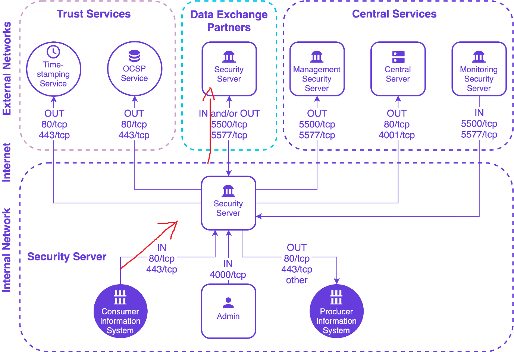

<p align="center"> FIGURE 47 – ACCESSING OPEN_API </p>

- GET https://ss1.company1.com/r1/CAMBODIA/COM/PRO00001/OPEN_API/heroku
- Header: X-Road-Client: CAMBODIA/COM/PRO00001/CONSUMER

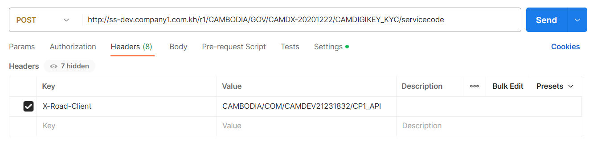

<p align="center"> FIGURE 48 – ACCESSING **OPEN_API** </p>

- https://ss1.company1.com/r1/ => Request from Security Server Member that was allowed in the ACL 
- **CAMBODIA/COM/PRO00001/OPEN_API/heroku** => To Access Service “**heroku**” on Subsystem named “**OPEN_API**” of Security Server with Member Code “**PRO00001**” 
- X-Road-Client: **CAMBODIA/COM/PRO00001/CONSUMER** => ID of Security Server’s Subsystem allowed in the ACL


This looks a bit confusing since both subsystems are on the same security server. Let’s see another scenario of two security server communication.


<p align="center"> FIGURE 49 – SCENARIO 2 ACCESSING OPEN_API </p>


This demo-scenario, the communication is between two Security Servers from different organization. The service provider organization is “**Techo Startup Center**” with Subsystem “**OPEN_API**” sharing Service named "**heroku**" and the service consumer organization is "**COMPANY1 CO LTD**" with Subsystem "**CONSUMER**" that was allowed the ACL of "**heroku**" service.


<p align="center"> FIGURE 50 – SCENARIO 2 ACCESSING OPEN_API </p>

- https://ss1.company1.com/r1/ => Request from Security Server Member that was allowed in the ACL 
- **CAMBODIA/GOV/CAM00002/OPEN_API/heroku** => To Access Service "**heroku**" on Subsystem named "**OPEN_API**" of Security Server with Member Code "**CAM00002**".
- X-Road-Client: **CAMBODIA/COM/PRO00001/CONSUMER** => ID of Security Server’s Subsystem allowed in the ACL of service "**heroku**"

## 5 COMMANDS USED
```bash
sudo apt update
sudo apt upgrade
sudo timedatectl set-timezone Asia/Phnom_Penh
sudo adduser camdx-systemadmin

echo deb [arch=all,amd64] http://repository.camdx.gov.kh/repository/camdx-release bionic main | sudo tee -a /etc/apt/sources.list

curl http://repository.camdx.gov.kh/repository/camdx-anchors/api/gpg/key/0x04194DBF-pub.asc | sudo apt-key add -

sudo apt update
sudo apt install xroad-securityserver
sudo apt install xroad-addon-proxymonitor
sudo apt install xroad-addon-opmonitoring
sudo systemctl restart xroad-opmonitor
```
## 6 REFERENCES

X-Road/ig-ss_x-road_v6_security_server_installation_guide.md at camdx-6.23.0 · CamDX/X-Road. (2022). Retrieved 26 May 2022, from <https://github.com/Techo-Startup-Center/CamDX/blob/camdx-6.23.0/doc/Manuals/ig-ss_x-road_v6_security_server_installation_guide.md>
